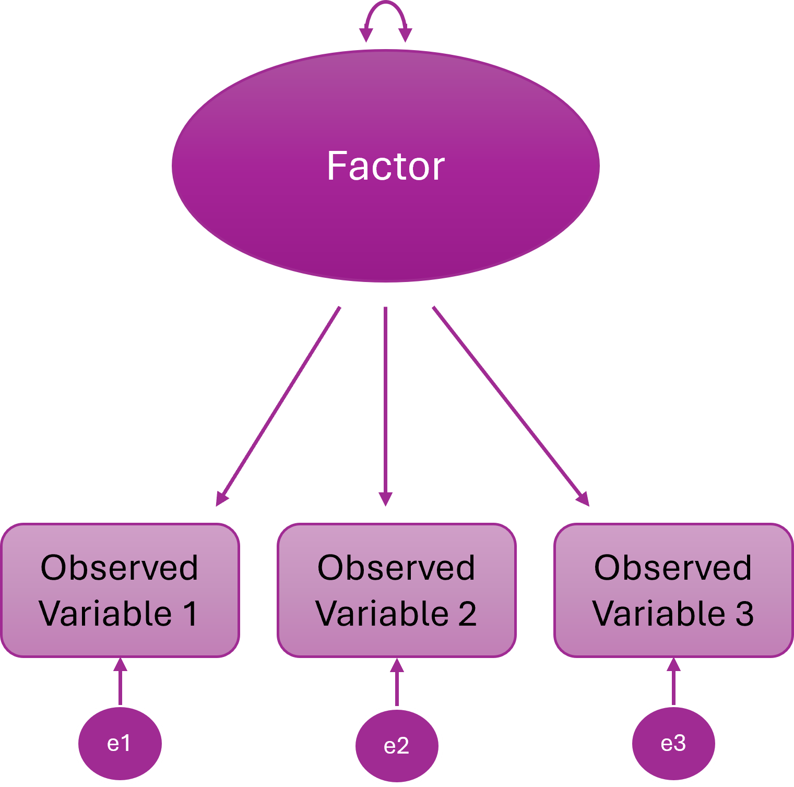
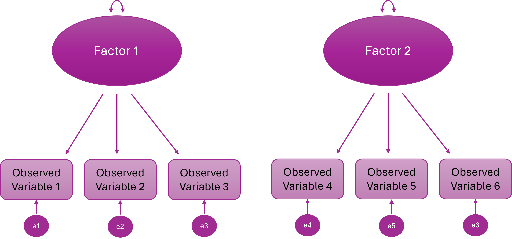
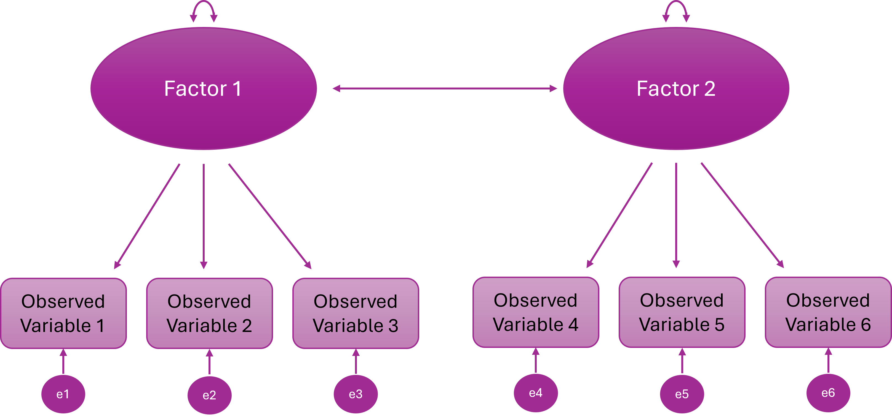
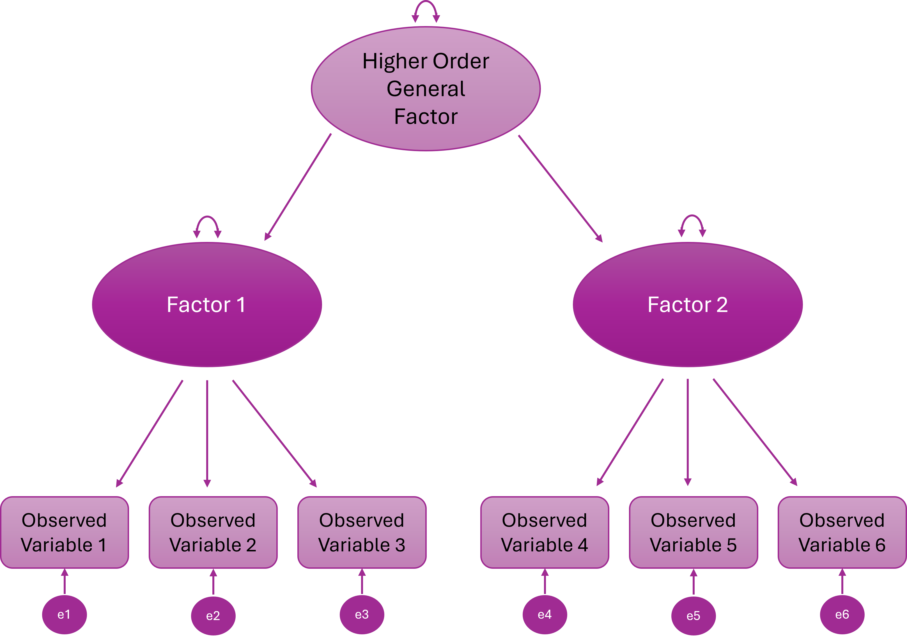
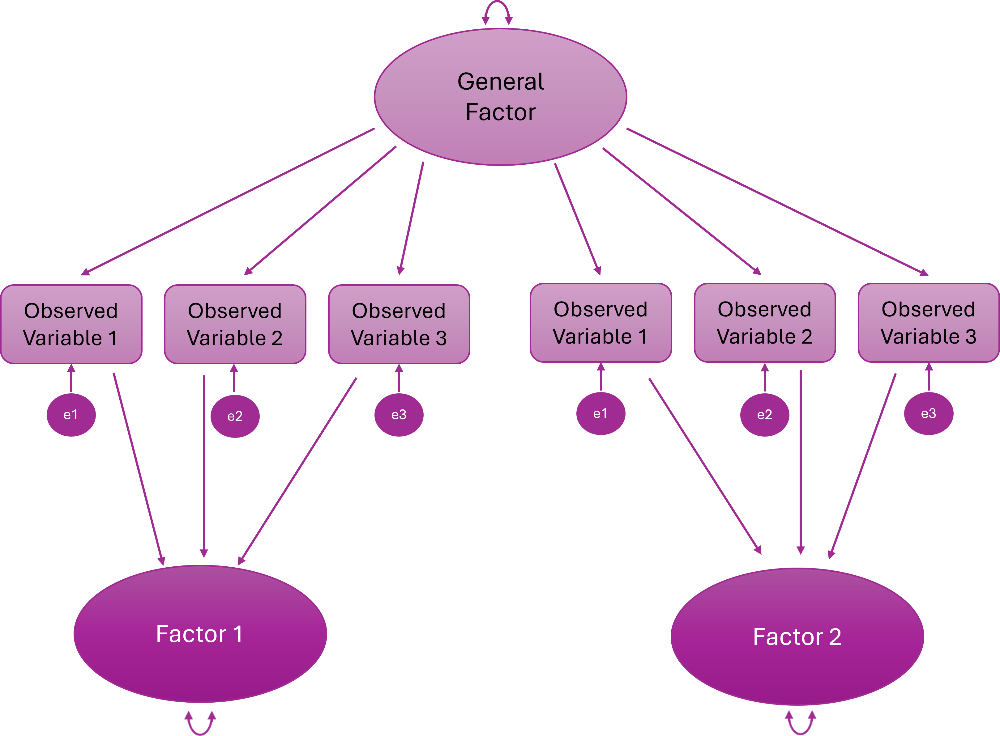
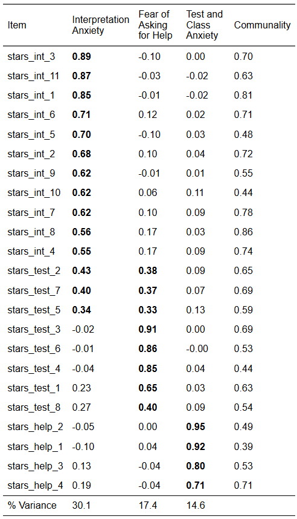
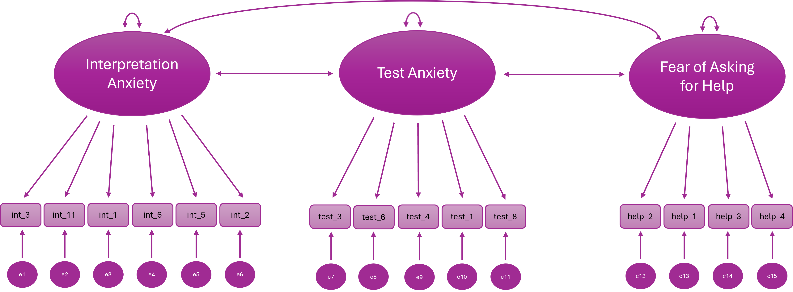

# Confirmatory Factor Analysis

## CFA (Week 8) Overview

### Learning Objectives

By the end of the Week 8 tutorial & workshop, students will be able to:

1.  **Explain the purpose of confirmatory factor analysis** (CFA) and distinguish it from exploratory factor analysis (EFA).

2.  **Assess a dataset’s suitability for CFA**, including evaluating sample size, scale type, missing data, and distributional assumptions.

3.  **Specify a theoretically justified measurement model**, choose factor scaling methods, and select an appropriate estimator.

4.  **Fit a CFA model and critically evaluate local and global model fit**, including factor loadings, R², correlations, and fit indices (χ², CFI, TLI, RMSEA, SRMR).

5.  **Identify and address potential model misfit, improper solutions, and modification indices** to refine the model while maintaining theoretical coherence.

6.  **Report CFA results clearly and transparently**, detailing model specification, estimation, parameter estimates, fit indices, and any justified modifications.

### Structure

#### Section 1: Lecture

-   **Part 1: Understanding CFA** - an introduction to the core conceptual and statistical foundations of CFA.

#### Section 2: Code Walkthrough

-   **Part 2: Conducting a CFA** - how to understand and conduct each step of a comprehensive CFA using the `lavaan` package in R, from pre-analysis checks to interpretation and reporting.

#### Section 3: Worksheet

-   **Part 3: Worksheet** - a series of exercises for you to practice conducting a CFA.

## Introduction

### Scale Development Process (Recap)

You may remember from EFA week that developing a psychological scale is a multi-stage process that moves from theory to statistical testing and back again and that, generally speaking, it should follow these key phases:

1.  Define the construct

2.  Generate items

3.  Collect data

    a.  **Explore scale structure and remove problematic items (EFA)**

    b.  Evaluate internal consistency of the factors (reliability analysis)

4.  Collect new data (or split the EFA data and use the remaining portion)

    a.  **Evaluate the factor structure suggested by EFA using confirmatory factor analysis (CFA)**

    b.  **Evaluate whether the scale measures the same construct in the same way across groups (measurement invariance; MI)**

5.  Collect new data (ideal, but rare in practice)

    a.  Examine validity evidence (e.g., convergent/discriminant validity, criterion validity)

6.  Ongoing validity and generalisabilty checks (also rare in practice)

    a.  Evaluate and refine the scale across new samples, contexts, and time

This week, **we're going to evaluate the factor structure suggested by last week's EFAs using CFA**.

## Part 1: Understanding CFA

### Conceptual Foundations

#### What is CFA & Why Do We Use It?

**Confirmatory Factor Analysis (CFA)** is a statistical technique used to test whether your data fit a **pre-specified measurement model**.

That “pre-specified” bit is everything.

In CFA, you decide in advance:

-   How many **latent factors** exist

-   Which items **load** onto which factor

-   Which loadings are **fixed to zero** (i.e., which items should *not* measure the latent factor)

-   Whether and which **factors correlate**

-   Whether **residuals correlate** (when two items share something in common that your factors don’t capture)

You are not asking: “What structure is hiding in my data?”.

You are asking: **“Does my theoretically specified structure hold up?”.**

#### How is CFA Different from EFA?

**Exploratory Factor Analysis (EFA)** = **discovery** mode

-   All items can load on all factors

-   Structure emerges from the data

-   Used when theory is weak or unclear

**CFA** = **hypothesis-testing** mode

-   Items are restricted to load only on specified factors

-   Cross-loadings are usually fixed to zero

-   The model is evaluated against the data

If EFA is “What’s in here?”, CFA is “Does this match what we expected?”.

EFA builds the map. CFA checks if the map is accurate.

#### The Measurement Model

In CFA, we assume that **latent variables** (e.g., anxiety, motivation, identity, IQ, attraction) are **not directly observed** (just like EFA).

Instead, we measure them using **observed variables** (aka 'items', 'indicators'), which are treated as **imperfect indicators** of the underlying construct.

For example, when modelling something like **depression**, we assume that questionnaire items (e.g., “I feel sad”, “I struggle to enjoy things”) are **reflections of an underlying latent construct** called *depression*.

The way those items relate to the latent variable — for example, **which items belong to which factors and how strongly they load** — is known as the **measurement model** (aka 'structural model').

Importantly, these assumptions are not unique to CFA. They come from the **common factor model**, which underlies **both EFA and CFA**.

The key difference between EFA and CFA is **not the idea of latent variables**, but **how much structure the researcher specifies in advance**.

#### Types of Measurement Model

There are several core measurement model structures that we can implement to test different theories.

We can't get through all of them in detail on this course, but it is still worth knowing what they all look like and what they do.

If you want to learn more about higher order or bifactor models (and a whole bunch of other cool stuff!) I recommend Erin Buchanen's open materials: <https://statisticsofdoom.com/page/structural-equation-modeling/>.

##### One-Factor Model

-   All items (observed variables) load onto a single (latent) factor

-   One underlying construct explains the covariance among all items

{fig-align="center" width="458"}

##### Two-Factor Model

-   Items cluster onto two different latent variables

-   Two distinct constructs explain the item correlations

-   The two latent variables are statistically independent

-   In other words, people high on F1 are not systematically higher or lower on F2

{fig-align="center" width="739"}

##### Two-Correlated-Factor Model

-   Items cluster onto two different latent variables

-   The constructs are distinct but related (they share some underlying variance)

-   Some people high on F1 tend to be high on F2

{fig-align="center" width="803"}

##### Higher Order (Hierarchical) Factor Model

-   A higher-order general factor explains why the lower-order factors correlate

-   Items load onto first-order factors; First-order factors load onto the higher order factor

{fig-align="center" width="804"}

##### Bifactor Model

-   Every item loads on a general factor *and* one specific factor

-   The general and specific factors are **orthogonal** (uncorrelated)

{fig-align="center" width="767"}

#### What Can CFA Do?

**1. Test Theories**

If a theory says, for example:

-   There are 3 distinct constructs

-   Each has specific indicators

-   They are correlated but distinct

CFA lets you test whether that structure actually fits.

If it doesn’t fit? The theory — or the measurement model — needs revisiting.

When we are using CFA for scale development and we want to test the factor structure derived from an EFA, we are testing theory.

**2. Validate Scales**

Suppose you’re using a published questionnaire in your research.

You might want to make sure that the proposed factor structure replicates in your sample.

CFA is advisable (but very rarely done!) before running running linear — or other kinds of — models.

If the measurement model is wrong, everything built on top of it is shaky.

Testing the validity of existing scales can be very important, publishable work in its own right.

**3. Compare Competing Models**

CFA allows formal model comparisons, such as:

-   One-factor vs two-factor models

-   Correlated factors vs higher-order factor models

-   Bifactor vs correlated-factor structures

Instead of arguing conceptually, you can test which model fits better *statistically*.

**3. Test Measurement Invariance**

CFA is the backbone of measurement invariance testing.

You can test whether:

-   Factor loadings are equal across groups

-   Intercepts / thresholds are equal

-   Residual variances are equal

Without CFA, you cannot properly test whether a scale operates equivalently across groups.

### Statistical Foundations

CFA is a very specific statistical model for explaining the relationships between observed variables.

At its core, CFA is about one thing: *Can a small number of latent variables reproduce the covariance matrix we observe in our data?*

#### The Core Idea: Reproducing the Covariance Matrix

CFA does **not** try to reproduce raw scores. It tries to reproduce the **covariance matrix**.

Why? Because covariances tell us how variables relate to each other, and factor models are fundamentally models of shared variance.

In CFA, we:

1.  Propose a measurement model

2.  Use it to generate an **implied covariance matrix** (the model)

3.  Compare that implied matrix to the **observed covariance matrix** (the data)

4.  Assess how close they are

If they’re close enough → the model "fits".

In practice, we rarely reproduce the covariance matrix perfectly. Instead, we evaluate whether the discrepancies between the observed and model-implied matrices are small enough to consider the model *plausible*.

#### Structural Equation Modelling Framework

CFA sits within the broader framework of **Structural Equation Modelling (SEM)**.

SEM allows researchers to:

-   model **latent variables**

-   **estimate measurement error** explicitly

-   **test overall model fit**

-   **compare competing theoretical models**

In CFA specifically, we are testing a **measurement model** — a model that specifies how observed variables relate to underlying latent constructs.

To do this, SEM represents the model using a set of **equations** that describe:

1.  **how observed variables are generated from latent factors**, and

2.  **what relationships between variables the model predicts**

These two ideas are captured by two key equations in the common factor model:

-   the **measurement equation**, which describes how latent variables produce observed indicators

-   the **covariance equation**, which describes the pattern of relationships the model implies between observed variables

Together, these equations define the model that CFA estimates.

#### The Measurement Model (Variable Level)

First, we describe **how each observed variable is generated**.

Conceptually, each observed variable is decomposed into:

-   a **latent factor component**

-   a **residual (unique/error) component**

In other words: **observed score = shared variance (factor) + unique variance (error)**.

::: {.callout-note collapse="true"}
##### Measurement Equation of the Common Factor Model

The CFA model formalises this decomposition as:

$$
\mathbf{x} = \boldsymbol{\Lambda} \mathbf{\eta} + \boldsymbol{\epsilon}
$$

Where:

-   **x** = vector of observed variables

-   **Λ (Lambda)** = matrix of factor loadings

-   **η (eta)** = vector of latent factors

-   **ε (epsilon)** = vector of residuals

This equation simply formalises: **Each observed variable is a weighted combination of latent factors plus residual error.**
:::

#### The Covariance Equation (Relationship Level)

Once we assume that each observed variable is generated from latent factors plus residual error, we can derive what the **covariance matrix of the observed variables should look like**.

Items are related for two reasons:

1.  They share **common latent factors**

2.  They contain **residual variance** (measurement error and item-specific variance)

This means that: **observed relationships between items = shared variance explained by factors + residual variance**

CFA works by estimating parameters so that the **relationships predicted by the model match the relationships observed in the data**.

::: {.callout-note collapse="true"}
##### The Model-Implied Covariance Equation

Formally, the covariance matrix implied by the model is:

$$
\Sigma = \boldsymbol{\Lambda} \boldsymbol{\Phi} \boldsymbol{\Lambda}' + \boldsymbol{\Theta}
$$

Where:

-   **Λ** = loading matrix

-   **Φ (Phi)** = covariance matrix of latent factors

-   **Θ (Theta)** = residual covariance matrix

This is the core engine of CFA: the model estimates parameters so that the **model-implied covariance matrix closely matches the observed covariance matrix**.
:::

#### Statistical Assumptions

CFA rests on several statistical assumptions that **underpin estimation and model fit:**

-   **Correct model specification**

    -   The hypothesised factor structure must reflect the true latent structure... well, formally at least...!

    -   ... in reality, we rarely know the true structure, so CFA is always **an approximation based on theory or prior evidence** (e.g., a previous EFA or well-established scales) and small discrepancies are expected

-   **Independent observations**

    -   Responses should not be dependent (e.g., no repeated measurements without accounting for clustering)

-   **Distributional assumptions**

    -   Standard ML requires **multivariate normality** and continuous indicators
    -   For ordinal or categorical items, robust estimators (WLSMV/DWLS) are preferred; these rely on **polychoric correlations**
    -   Relationships among variables should be **roughly linear** for continuous items or **monotonic** for ordinal items

Violations don’t automatically destroy the model — but they affect estimation and fit indices.

#### Practical Requirements / Design Considerations

These are also **important to check before running CFA**, but are not formal *statistical* assumptions.

-   **Meaningful covariances between items**

    -   Items must share variance that can plausibly be explained by the latent factors.

    -   If items are essentially uncorrelated, the model cannot capture meaningful structure, and fit indices will be poor.

    -   Correlations across factors hint at **theoretical overlap**, which may require reconsidering your model or allowing factor correlations in CFA.

    -   **Rule of thumb:** Each item should correlate moderately (r ≈ 0.3–0.8) with other items in the same factor.

-   **Scale type**

    -   Data should be **continuous, ordinal, or binary**

    -   Standard CFA cannot model nominal (unordered) categories or highly skewed continuous variables (they may require transformation or robust estimation)

    -   If your items are ordinal (e.g., 5-point Likert), treating them as continuous may be acceptable under some conditions (e.g., ≥5 categories, reasonably symmetric distributions), but this is a judgement call, not a default.

-   **Adequate sample size**

    -   Estimation and fit indices are sensitive to sample size, especially for complex models or weak loadings.

    -   Adequacy depends on number of factors, indicators per factor, factor loadings, and estimator (so rules of thumb can be way off).

    -   Practical minimum for most CFA models: \~200, but smaller samples can work for strong, simple models; larger samples are needed for weak loadings, complex models, or invariance testing.

-   **Missing data**

    -   Inspect patterns of missingness before analysis.

    -   Decide on handling strategy: e.g., FIML for continuous ML, pairwise approaches for WLSMV.

    -   Ignoring systematic missingness can bias estimates and fit indices.

-   **Identification**

    -   A CFA model must be **identified** for estimation to be possible.

    -   Every parameter you estimate (factor loadings, factor variances/covariances, residual variances, thresholds/intercepts) consumes **information from the data**.

    -   There must be **more pieces of information (observed covariances and variances)** than **parameters to estimate**.

    -   Formally, the model must have **positive degrees of freedom**

    -   If a model is **not identified**, the software cannot solve it — you might get errors or nonsensical parameter estimates, and no amount of “optimism” will help.

**The degrees of freedom of a CFA model are calculated as:**

$$ df = \text{Number of unique observed variances and covariances} - \text{Number of free parameters} $$

-   If `df < 0` → **under-identified** (cannot estimate)

-   If `df = 0` → **just-identified** (fits perfectly, cannot test hypotheses)

-   If `df > 0` → **over-identified** (testable, ideal)

::: {.callout-note collapse="true"}
##### What is a threshold?

In the context of CFA (and more broadly, ordinal or categorical data modeling), a **threshold** is essentially the boundary between categories on an observed ordinal variable. Let me break it down carefully:

**Conceptual Explanation**

-   Suppose you have an item with responses like: 1 = Strongly Disagree, 2 = Disagree, 3 = Neutral, 4 = Agree, 5 = Strongly Agree.

-   Ordinal items are thought of as arising from an **underlying continuous latent response variable**.

-   The **thresholds** define the points on this latent continuum where respondents typically transition from one category to the next.

**Example:**

Say you have a 5-point Likert item (1–5). The latent variable (attitude) is continuous. The model might estimate thresholds like this:

| Threshold | Meaning                  |
|-----------|--------------------------|
| τ₁ = -1.2 | Between category 1 and 2 |
| τ₂ = -0.3 | Between category 2 and 3 |
| τ₃ = 0.8  | Between category 3 and 4 |
| τ₄ = 2.0  | Between category 4 and 5 |

Interpretation:

-   Anyone with a latent score \< -1.2 → observed category 1 (“Strongly Disagree”)

-   Between -1.2 and -0.3 → category 2 (“Disagree”)

-   Between -0.3 and 0.8 → category 3 (“Neutral”)

-   Between 0.8 and 2.0 → category 4 (“Agree”)

-   2.0 → category 5 (“Strongly Agree”)

Notice:

-   The **observed labels are integers** (1, 2, 3, 4, 5)

-   The **thresholds are decimals** on the latent variable scale.

**Technical Explanation**

-   In **lavaan**, when you set `ordered = TRUE`, the model estimates **thresholds for each ordinal variable**.

-   These thresholds are like cut-points on a latent continuous variable such that:

In CFA with ordinal items, the probability of observing category $k$ or below is given by:

$$
P(Y \le k) = \Phi(\tau_k - \lambda \eta)
$$

Where:

-   $Y$ is the observed ordinal response.\
-   $k$ indexes the response category.\
-   $\Phi$ is the standard normal cumulative distribution function (used in WLSMV estimation).\
-   $\tau_k$ is the $k$th threshold.\
-   $\lambda$ is the factor loading for the observed variable.\
-   $\eta$ is the latent factor score.

Essentially, the thresholds map the **continuous latent response** onto **discrete observed categories**.

**Takeaway**

-   Thresholds are only relevant for **ordinal/categorical items**.

-   They are like invisible dividing lines along the latent variable that “decide” which response category is observed.

-   If you have continuous variables, there are **no thresholds** — the variable is measured directly.
:::

## Part 2: Conducting a CFA

### CFA Process Overview

To run a CFA, you will usually complete the following steps:

**Pre-analysis checks:**

-   Theoretical model specification

-   Independent observations

-   Distributional assumptions

-   Meaningful covariances between items

-   Scale type

-   Sample size

-   Missing data inspection

-   Identification check (although a prerequisite, we check this after we've run the model)

**Prepare the model:**

-   Specify the measurement model

-   Decide on factor scaling method

-   Choose an estimator

**Fit then check the model:**

-   Check warnings

-   Check for improper solutions

-   Check potential misfit

**Inspect parameter estimates (local fit):**

-   Factor loadings

-   R-squared

-   Factor correlations

**Evaluate model fit (global fit):**

-   χ² test

-   CFI / TLI

-   RMSEA

-   SRMR

**Model refinement (if justified):**

-   Check modification indices

-   Re-fit and compare

**Report (tables and in-text):**

-   Model specification

-   Estimator used

-   Parameter estimates

-   Fit indices

-   Any modifications made

So, not much then!

We are now going to walk through how to complete each of these steps using the same worked example as last week.

### The Statistics Anxiety Rating Scale (STARS)

Previously, we conducted an EFA on 23 items designed to measure three facets (subscales) of statistics anxiety. No items were reverse-scored.

Participants respond to each item with a 1 (low) to 5 (high) rating of how anxious they feel in each situation (making this a **Likert scale**).

From the EFA, we retained a three-factor solution that looked like this:

{fig-align="center"}

We are now going to test this structure with CFA. However, we are only going to model the first six items on the Interpretation Anxiety factor because a) there is no practical need for that many items, b) it gets rid of the problematic cross-loadings (which we would want to do anyway), and c) and it will save us some typing!

Our new hypothesised model looks like this:

|  |  |  |
|-------------------|-------------------|----------------------------------|
| **Variable** | **Subscale** | **Item** |
| stars_int_3 | Interpretation Anxiety | Reading a journal article that includes some statistical analyses |
| stars_int_11 | Interpretation Anxiety | Trying to understand the statistical analyses described in the abstract of a journal article |
| stars_int_1 | Interpretation Anxiety | Interpreting the meaning of a table in a journal article |
| stars_int_6 | Interpretation Anxiety | Interpreting the meaning of a probability value once I have found it |
| stars_int_5 | Interpretation Anxiety | Reading an advertisement for a car which includes figures on miles per gallon, depreciation, etc. |
| stars_int_2 | Interpretation Anxiety | Making an objective decision based on empirical data |
| stars_test_3 | Test Anxiety | Doing an examination in a statistics course |
| stars_test_6 | Test Anxiety | Waking up in the morning on the day of a statistics test |
| stars_test_4 | Test Anxiety | Walking into the room to take a statistics test |
| stars_test_1 | Test Anxiety | Studying for an examination in a statistics course |
| stars_test_8 | Test Anxiety | Going over a final examination in statistics after it has been marked |
| stars_help_2 | Fear of Asking for Help | Asking one of my teachers for help in understanding statistical output |
| stars_help_1 | Fear of Asking for Help | Going to ask my statistics teacher for individual help with material I am having difficulty understanding |
| stars_help_3 | Fear of Asking for Help | Asking someone in the computer lab for help in understanding statistical output |
| stars_help_4 | Fear of Asking for Help | Asking a fellow student for help in understanding output |

Crucially, the data we are using for our CFA is a different sample to the data we used for our EFA.

Let's read in the data, select only the variables we need, and check the sample size. Make a mental note of it for now.

```{r}
#| message: false
#| warning: false
stars_data <- readr::read_csv(here::here("data/stars_cfa_data.csv")) |>
            dplyr::select(stars_int_3,
                          stars_int_11,
                          stars_int_1,
                          stars_int_6,
                          stars_int_5,
                          stars_int_2,
                          stars_test_3,
                          stars_test_6,
                          stars_test_4,
                          stars_test_1,
                          stars_test_8, 
                          stars_help_2,
                          stars_help_1,
                          stars_help_3,
                          stars_help_4)
```

### Pre-Analysis Checks

Let's start with out pre-analysis checks.

To recap, these are:

-   Theoretical model specification

-   Independent observations

-   Distributional assumptions

-   Meaningful covariances between items

-   Scale type

-   Sample size

-   Missing data inspection

-   Identification check

#### Theoretical Model Specification

🤔 **Where will get our theoretical model from?**

::: {.callout-tip collapse="true"}
##### Solution

Our EFA! This is what we're modelling:

{fig-align="center"}
:::

#### Distributional Assumptions

Our data is ordinal, so the distributional assumption we need to check is that the items have a **monotonic relationship** with the underlying latent factors.

To recap, a monotonic relationship can be thought of as the ordinal analogue of a linear relationship: higher (or lower) values on the latent factor are associated with correspondingly higher (or lower) values on the observed categories, preserving the rank order even if the relationship is not strictly linear.

In other words, the observed categories are **ordered reflections of the underlying latent variable**.

This is why we use **polychoric correlations**: they estimate the association between the latent continuous responses, not the raw ordinal numbers.

We don't usually formally check monotonic relationships. Instead we look for stable, interpretable polychoric correlations.

::: {.callout-note collapse="true"}
##### What if our data were continuous?

**Assumptions:** multivariate normality, roughly linear relationships

**Bivariate Linearity**

-   Check Scatterplots of item pairs within factors

-   They should look roughly linear; gross nonlinearity may reduce fit or distort loadings

**Multivariate Normality**

-   Formal tests exist (e.g., `MVN::mvn()` for Henze-Zirkler or Mardia’s test), but these are highly sensitive to sample size

-   In large samples, minor deviations are usually acceptable anyway; focus on extreme skew, outliers, or illogical correlations
:::

#### Meaningful Covariances Between Items

We can check this with a correlation heatmap, just like we did for EFA:

```{r}
stars_corr <- psych::polychoric(stars_data)$rho #<1>

stars_heatmap <- psych::cor.plot( #<1>
  stars_corr, #<2>
  upper = FALSE, #<3> 
  diag = FALSE, #<4> 
  cex = 0.3, #<5>## 
  cex.axis = 0.4, #<6>
  las = 2, #<7>
  main = "Polychoric Correlation Heat Map of STARS Items" #<8>
)
```

🤔 **Do we have meaningful correlations?**

::: {.callout-tip collapse="true"}
##### Solution

Yes — items are clustering within their factors as expected ($r_{pc}$ ≈ 0.3–0.8)...

... but we know from EFA week that there may be so much shared variance in these items that we're dealing with unidimensionality.
:::

#### Data Requirements

🤔 **Does our data meet the data requirements (independent observations, scale type, sample size)?**

::: {.callout-tip collapse="true"}
##### Solution

**Independent observations** — yes, the data is from a single time-point with no other known dependencies

**Scale type** — yes, the data is ordinal

**Sample size** — yes, *N* = 3487
:::

#### Missing Data

Missing data is common in survey research, but it needs careful attention because **CFA estimates and fit indices can be biased if missingness is ignored**.

Ignoring missing data (e.g., using **listwise deletion** blindly) can:

-   Reduce sample size → lower statistical power

-   Distort fit indices, factor loadings, and residual variances

-   Introduce **bias** if missingness is related to the latent trait

**Step 1: Check the percentage of missing data at the item and the participant level**

Typical rough guidelines:

-   \< 5% — not a problem, proceed as normal

-   5–10% — usually manageable

-   10-20% — possibly manageable

-   \> 20% — could be a big problem

Let's see what we have in the STARS dataset.

```{r}
# summary of missingness per item
item_missing <- stars_data |> #<1>
  dplyr::summarise( #<2>
    dplyr::across( #<3>
      dplyr::everything(), #<4>
      ~ mean(is.na(.)) * 100 #<5>
    )
  )

# summary of missingness per participant
participant_missing <- stars_data |> #<6>
  dplyr::mutate( #<7>
    missing_pct = rowMeans(is.na(stars_data)) * 100 #<8>
  ) |> 
  dplyr::count(missing_pct) #<9>
```

1.  Start with the `stars_data` dataset to summarise missingness per item.

2.  Use `summarise()` to reduce the dataset down to a single row of summary statistics.

3.  Apply a function across multiple columns using `across()`.

4.  Target all columns in the dataset (`everything()`).

5.  Calculate the percentage of missing values for each item (`mean(is.na(.)) * 100`).

6.  Start with the `stars_data` dataset to summarise missingness per participant.

7.  Use `mutate()` to create a new column representing each participant’s missingness.

8.  Compute the row-wise mean of missingness (`rowMeans(is.na(stars_data))`) and convert it to a percentage.

9.  Count the number of participants with each unique missingness percentage using `count()`

🤔 **Do we have a missing data problem with this dataset?**

::: {.callout-tip collapse="true"}
##### Solution

No — the maximum % missing for each item was 0.09 and for each participant was 6.67 and only for 7 participants. In such a large dataset, these numbers are negligible so we can proceed as normal.

If we had bigger problems, we'd have to carry out further checks and take appropriate action (see callout below for an overview).
:::

::: {.callout-note collapse="true"}
##### What should you do if you have problematic levels of missing data?

This is a complex topic that, frankly, deserves a tutorial all to itself. We can't get into the nitty-gritty here, but I want you to at least be aware that this is a thing and give you some resources in case you need to tackle it in the future.

What I'm about to say is not just relevant to CFA, by the way - missing data can cause problems in all your statistical models and inferences!

Okay, so you completed Step 1 and you've got large %s of missing data. What's next?

**Step 2: Look for systematic patterns, e.g., missing all responses from a certain sub-group**

The next step is to examine **how the missing data are distributed** in your dataset.

Ideally, missing responses occur more or less randomly across participants and items. However, sometimes clear patterns emerge. For example:

-   A subgroup of participants (e.g., a particular demographic group) may be more likely to skip certain items

-   Participants may stop responding partway through a questionnaire (a *drop-out* pattern)

-   Certain items may be skipped much more frequently than others (perhaps because they are confusing or sensitive)

These kinds of patterns suggest that the missingness may be **systematic rather than random**, which can bias parameter estimates and distort conclusions if not handled appropriately.

At a basic level, you might examine:

-   Missingness by participant (e.g., some people skipping many items)

-   Missingness by item (e.g., problematic questions)

-   Whether missingness is associated with other variables in the dataset (this is something you may need to plan for in advance)

**Step 3: Decide on a handling strategy**

Once you have a sense of the missing data patterns, you need to decide **how to handle them in your analysis**.

Common approaches include:

-   **Listwise deletion** – removing cases with missing data

-   **Pairwise deletion** – using all available data for each estimate

-   **Full Information Maximum Likelihood (FIML)** – estimating model parameters using all available information

-   **Multiple imputation** – replacing missing values with plausible estimates based on other variables

Different approaches make different assumptions about **why the data are missing**. For example, many modern methods assume data are *missing at random* (MAR), meaning that the probability of missingness can be explained by observed variables in the dataset.

In structural equation modelling (including CFA), likelihood-based approaches such as **FIML** (full information maximum likelihood) or imputation methods are often preferred because they tend to produce less biased estimates than simple deletion methods.

However, you cannot use FIML with ordinal data - pairwise deletion or multiple imputation are your only options! 😞

The key takeaway is that **missing data should rarely be ignored**. When substantial missingness is present, it is important to diagnose the problem and choose an appropriate strategy before proceeding with your analysis.

**Further Resources**

-   Enders, C. K. (2022). *Applied Missing Data Analysis*. (2nd ed.). Guilford Press.

-   van Buuren, S. (2018). *Flexible Imputation of Missing Data* (2nd ed.). CRC Press. <https://stefvanbuuren.name/fimd/>

-   Graham, J. W. (2009). Missing data analysis: Making it work in the real world. *Annual Review of Psychology*, 60, 549–576. <https://imaging.mrc-cbu.cam.ac.uk/statswiki/FAQ/emalgm?action=AttachFile&do=get&target=graham.pdf>
:::

#### Model Identification

You don’t need R for this — you can usually tell **by counting parameters**:

***Step A: Count the Free Parameters***

For a CFA model:

1.  **Factor loadings** (usually all except the reference indicator if using `std.lv = TRUE` or fixing the first loading \[which we will do\])

2.  **Factor variances/covariances** (for all latent factors)

3.  **Residual variances** (for all observed items)

4.  **Thresholds/intercepts** (for all continuous indicators, just intercepts; for ordinal, thresholds instead).

🤔 **How many free parameters are there in our model?**

::: {.callout-tip collapse="true"}
##### Solution

Our model has:

-   `interpret` → 6 indicators

-   `test` → 5 indicators

-   `help` → 4 indicators

**Total observed variables:** 15

1.  **Factor loadings** — we will fix the first loading on each factor to 1, so we're freely estimating 5 `interpret` indicators, 4 `test` indicators, and 3 `help` indicators (so, 12 free factor loadings)
2.  **Factor variances & covariances** — there are 3 factors, each with a variance (so, 3 variances); and a covariance between each pair (so, 3 covariances)
3.  **Residual variances** —1 for each observed variable (so, 15 residual variances)
4.  **Thresholds (ordinal indicators)** —
    -   Each ordinal item with $k$ categories (response options) has $k-1$ thresholds

    -   All items have 5 response categories, so there are 4 thresholds per item

    -   Total thresholds = 15 × 4 = 60

**Total free parameters:** 12 (loadings) + 6 (factor var/cov) + 15 (residuals) + 60 (thresholds) = **93**
:::

***Step B: Count Unique Pieces of Information (Covariances)***

-   For continuous observed variables, the number of unique elements in the sample covariance matrix is:

$$
\text{Number of unique covariances} = \frac{p(p+1)}{2}
$$

-   Your **total free parameters must not exceed this**. If you have more parameters than unique pieces of info, the model is **under-identified**.

🤔 **How many unique pieces of information are there in our model?**

🤔 **Is the model over/under/just identified?**

::: {.callout-tip collapse="true"}
##### Solution

For 15 observed continuous variables, the **sample covariance matrix** contains:

$$
\text{Number of unique covariances} = \frac{p(p+1)}{2} 
= \frac{15(15+1)}{2} 
= 120
$$

-   **Variances:** 15 (one for each item)

-   **Covariances:** 105

Since 48 \< 120, we have **more than enough information** to estimate the model.

The model is theoretically **over-identified**, which is what we want.
:::

***Step C: Check Simple Rules of Thumb***

-   Each factor should have **at least 3 indicators** (for simple CFA) to avoid under-identification.

-   Fix the scale of each factor — either via **marker variable (first loading = 1)** or **factor variance = 1** (`std.lv = TRUE`) — we'll come back to this when we're preparing our model.

🤔 **Does our model meet the rules of thumb?**

::: {.callout-tip collapse="true"}
##### Solution

Yes - we have at least 3 indicators and we will fix the scale in the next section.
:::

### Prepare the Model

To recap, to prepare the model, we must:

-   Specify the measurement model

-   Choose an estimator

-   Decide on factor scaling method

#### Specify the Measurement Model

We specify the measurement model using `lavaan` syntax.

Notice there are no functions here — the package isn't really processing anything yet, we're just giving it the map of our hypothesised factor structure which it will store for later use.

```{r}
stars_meas_mod <- ' #<1> 
interpret =~ stars_int_3 + stars_int_11 + stars_int_1 + stars_int_6 + stars_int_5 + stars_int_2 #<2>  
test =~ stars_test_3 + stars_test_6 + stars_test_4 + stars_test_1 + stars_test_8  
help =~ stars_help_2 + stars_help_1 + stars_help_3 + stars_help_4 
' #<3>
```

1.  `stars_meas_mod <- '` — `stars_meas_mod` is the name we're giving our measurement model object; `'` is a single quotation mark (not a backtick) which denotes the opening of our measurement model
2.  `interpret =~ stars_int_3 + stars_int_11 + ...` — `interpret` is the name we're assigning the first factor; `=~` is an equals sign followed by a tilde, meaning *"**is measured by**"* in `lavaan`-ese; `stars_int_3 + stars_int_11 + ...` are the items loading onto the factor
3.  `'` to close the measurement model

Note that **factors are correlated by default**. To make them orthogonal, explicitly set it using `factor_1 ~~ 0*factor_2` (the double tilde denotes a covariance and multiplying a factor by 0 fixes it to zero).

#### Decide on Factor Scaling Method

Latent factors don’t have natural units so we need a **scaling method** to fix their variance or a loading so that the model can estimate parameters uniquely.

There are two common approaches:

1.  **Marker Variable (Reference Indicator) Method**

    -   Pick one indicator (item) per factor and fix its **loading to 1**

    -   This makes that item define the factor’s scale

    -   e.g., if the indicator's scale was 1-5, the factor's scale would now be 1-5

    -   `lavaan` fixes the first item on each factor to 1 by default

**Pros:** Intuitive; factor variance reflects the scale of the chosen indicator

**Cons:** You don't get an estimate of the loading for the first indicator; choice of marker can slightly affect other parameter estimates, especially with uneven loadings

2.  **Unit Variance (Fixed Factor Variance) Method**

    -   Fix the **latent factor variance to 1**, letting all loadings be freely estimated

**Pros:** Treats all indicators equally; often preferred in simulations or when comparing factors; you get estimates for all indicators

**Cons:** Factor scale becomes arbitrary—less intuitive in terms of the original items

**Rule of Thumb:**

-   For applied research where interpretation of factor scores matters (e.g., scale development) → **marker method**.

-   For simulation studies, structural models, or comparing factors → **unit variance method**.

🤔 **Which factor scaling method is most appropriate for our purposes?**

::: {.callout-tip collapse="true"}
##### Solution

For **scale development based on an EFA**, you almost always want the **marker (reference indicator) method**.

Here’s why:

1.  **Interpretability of factor scores** – The goal in scale development is usually to understand what each factor “means” in terms of your items. Fixing a loading to 1 ties the factor scale to a real, concrete item, making factor scores easier to interpret and communicate.

2.  **Consistency with EFA** – EFA gives you a sense of which items dominate each factor. Using a marker indicator lets you preserve that dominant-item scale in your CFA.

3.  **Reporting and comparisons** – You often want to report loadings relative to a meaningful baseline. Fixing the variance to 1 makes all loadings free, but then the factor itself is in an arbitrary unit — it’s harder to explain the factor to others.
:::

#### Choose an Estimator

Choosing the right estimator is like picking the right tool for a job: the type of data and your model assumptions matter.

In CFA, the estimator determines how the model tries to reproduce the observed covariances and affects the accuracy of your parameter estimates and fit statistics.

Here’s a quick guide:

-   **Maximum Likelihood (ML)** – The workhorse. Assumes continuous variables and multivariate normality. Performs well with large samples. Often the default.

-   **ML Robust / Satorra-Bentler (MLR)** – Like ML but adjusts standard errors and fit statitics if data deviate from normality. A safe choice for continuous but skewed data.

-   **Weighted Least Squares (WLS / WLSMV)** – Designed for ordinal or categorical data (like Likert scales). Handles non-normality better but usually needs larger sample sizes for stability.

-   **Diagonally Weighted Least Squares (DWLS)** – Uses only the diagonal of the weight matrix. Less sensitive to sample size than full WLS. Good for ordinal variables when your sample isn’t huge.

-   **Generalised Least Squares (GLS)** – Less common; assumes multivariate normality, sensitive to outliers. Can be faster with small models.

Quick rule of thumb:

-   **Continuous + roughly normal** → ML

-   **Continuous + non-normal** → MLR

-   **Ordinal / categorical + large sample** → WLSMV

-   **Ordinal / categorical + small sample** → DWLS

🤔 **Which estimator is most appropriate for our data?**

::: {.callout-tip collapse="true"}
##### Solution

**WLSMV** - we have ordinal data and a large sample
:::

### Fit and Check the Model

To recap, once we've fitted the model (and before we evaluate it), we'll need to:

-   Check warnings

-   Check for improper solutions

-   Check potential misfit

#### Fit Model

To fit the model in R, we use the `cfa()` function from the `lavaan` package [@rosseel2012].

```{r}
stars_fit <- lavaan::cfa( #<1>
  stars_meas_mod,         #<2>
  data = stars_data,      #<3>
  estimator = "WLSMV",   #<4>
  ordered = names(stars_data), #<5>
  std.lv = TRUE           #<6>
)
stars_fit
```

1.  Call the `cfa()` function from the `lavaan` package to fit a confirmatory factor analysis model.

2.  Provide the measurement model string (`stars_meas_mod`) defined previously.

3.  Specify the dataset (`stars_data`) containing the observed variables.

4.  Use the `WLSMV` estimator, suitable for ordinal data.

5.  Declare all variables in the dataset as ordered (ordinal), so the estimator handles them correctly.

6.  Standardise the latent variable variances to 1 (`std.lv = TRUE`) for identification.

#### Inspect Warnings

**`lavaan` likes to complain!** After running `cfa()`, look at any console messages.

**Typical warnings:**

-   `Warning: Some estimated correlations are > 1` → often due to multicollinearity or overfactoring

-   `Warning: model is not positive definite` → suggests linear dependencies or improper solutions

-   `Warning: convergence not reached after … iterations` → optimizer struggled; may need different estimator or starting values or it may be underidentified

-   Fit indices may also be flagged if the model is just-identified (degrees of freedom = 0) or if sample size is tiny.

#### Check for Improper Solutions (Heywood Cases)

A **Heywood case** occurs when a CFA model produces **impossible parameter estimates** (typically negative error variances), usually indicating **model misspecification, problematic items, or estimation instability**.

It happens when the model attributes *more variance to the latent factor than the item actually has*, leaving the estimated unique variance negative. In other words, the model is **trying too hard to explain the item with the factor**.

Check for:

-   **Negative variances** (`var < 0`)

-   **Loadings \> 1** (sometimes \> 1 is okay if standardised latent variables are used, but still worth checking)

```{r}
# residual variances
resid_var <- diag(lavaan::inspect(stars_fit, "theta")) #<1>
resid_var  #<2> 

# standardised factor loadings
std_load <- lavaan::standardizedSolution(stars_fit) #<3>
std_load <- std_load[std_load$op == "=~", c("lhs","rhs","est.std")] #<4>
std_load  #<5> 
```

1.  Extract the residual (error) variances for all observed variables from the CFA model using `inspect(..., "theta")` and select the diagonal.

2.  Print the residual variances; negative values may signal a Heywood case (impossible variance).

3.  Extract the standardised solution from the CFA fit, including factor loadings, residuals, and other standardised estimates.

4.  Filter to keep only the factor loadings (`=~`) and select the relevant columns: latent factor (`lhs`), observed variable (`rhs`), and standardised estimate (`est.std`).

5.  Print the standardised factor loadings; any values greater than 1 suggest a potential Heywood case.

::: {.callout-note collapse="true"}
##### More on Heywood Cases

A **Heywood case** is one of those moments in **confirmatory factor analysis (CFA)** where the model produces a **statistically impossible parameter estimate**. In practice, it usually means **a negative variance estimate** for an error term (or sometimes a factor variance). Variances can’t be negative in reality, so the result signals that **something is wrong with the model or the data**.

**What a Heywood case looks like:**

In CFA output (e.g., from [lavaan]{.underline}), the most common sign is **a negative residual variance for an indicator.**

Example:

| Parameter                   | Estimate |
|-----------------------------|----------|
| Residual variance of item 4 | −0.12    |

This would imply that the item has **less than zero unique variance**, which is impossible.

You may also see:

-   **standardised factor loading \> 1**

-   **Negative factor variance**

These are mathematically related manifestations of the same issue.

**Why Heywood cases happen:**

A Heywood case typically indicates **model strain**. Common causes include:

1\. **Model misspecification**

The factor structure is wrong.

Examples:

-   An item loads on the wrong factor

-   A cross-loading that exists in reality is constrained to zero

-   Correlated errors are omitted

This is the **most common cause in scale development work**.

2\. **Extremely high loadings**

If an item loads *very* strongly on a factor, the model may try to estimate its residual variance as negative.

Conceptually:

Item variance = common variance + unique variance

If the model estimates **too much common variance**, the remaining unique variance becomes negative.

**3. Small sample size**

With limited data, sampling fluctuations can push estimates outside the allowable range.

**4. Highly correlated items or factors**

Near-multicollinearity can destabilise estimation.

**5. Poorly behaving items**

Items with:

-   Very low variance

-   Extreme skew

-   Redundant wording

Can destabilise the model.

**How to diagnose it:**

Look for:

-   **Negative residual variances**

-   **standardised loadings \> 1**

-   **Very large standard errors**

-   **Warnings in the output**

**What you should *not* do:**

A common temptation is to **force the variance to be positive** (e.g., constraining it to zero).

That’s usually **treating the symptom, not the cause**.

Before constraining anything, check whether the **model itself is wrong**.

**What to do instead:**

Typical steps:

1.  **Check the standardised loadings**
    -   Is one item loading \\\> .95 or \\\> 1?
2.  **Inspect modification indices** (more on this later)
    -   Is a cross-loading being suppressed?
3.  **Check the EFA results**
    -   Does the CFA model match the exploratory structure?
4.  **Look at the problematic item**
    -   Is it redundant or ambiguous?
5.  **Consider removing the item**
    -   Often the simplest solution in scale development
:::

🤔**Do we have any warnings, convergence issues, or Heywood cases?**

::: {.callout-tip collapse="true"}
##### **Solution** {collapse="true"}

Nope!
:::

#### Check Potential Misfit

-   Look out for large standardised residuals (\> 4) in `residuals(stars_fit, type = "standardized")` – large residuals hint at misfit.

```{r}
lavaan::residuals(stars_fit, type = "standardized") #<1>
```

1.  Compute the **standardised residuals** for the CFA model (`stars_fit`)

🤔**Do we have any problematic standardised residuals?**

::: {.callout-tip collapse="true"}
##### **Solution** {collapse="true"}

Oh, hell yes — there are some **very large standardised residuals** that we should explore before moving on (and digging into this is actually a great way to learn more about what is going on under the hood of a CFA!).
:::

#### Standardised Residuals

In CFA, a **large residual** usually means the model is doing a poor job reproducing the relationship between two variables.

More specifically, a **raw** **residual** is:

$$
Residual\ (raw) = Observed\ correlation - Model\ predicted\ correlation
$$

So, it tells you **how far off the model is** for a particular relationship.

Raw residuals depend on the scale of the variables, so there’s **no universal cutoff**.

A value that looks big in one dataset might be trivial in another, so they’re rarely used for decision making.

In practice, we examine **standardised residuals**, which behave roughly like **z-scores**.

$$
Standardised\ Residual = \frac{Residual}{Standard\ Error\ of\ predicted\ covariance}
$$

Typical guidelines:

| Standardised residual | Interpretation                      |
|-----------------------|-------------------------------------|
| \< 2                  | Small / acceptable                  |
| 2 – 4                 | Potential misfit                    |
| \> 4                  | Large residual (clear local misfit) |

: So, a common rule of thumb: **absolute standardised residuals greater than about 2–2.5 may indicate localised model misfit**, even if the overall model fit looks good (more on that shortly).

Absolute values **above 4** are usually considered **very large** and definitely worth investigating.

**What a large residual means substantively:**

If a pair of items has a large residual, it means **the model** **underestimates or overestimates the relationship** between those items.

Common reasons include:

-   A **missing cross-loading**

-   **Correlated error terms**

-   An item that **belongs on a different factor**

-   Two items that are **worded very similarly**

**The sign of the standardised residuals matter:**

-   A **large *positive* standardised residual** means the **observed correlation is higher than the model predicts**

    -   The model **underestimates** the relationship between those items

-   A **large *negative* standardised residual** means the **observed correlation is lower than the model predicts**

    -   The model **overestimates** the relationship — it thinks the items are more strongly related than they actually are

**So, let's check our large standardised residuals in light of that:**

Below is a heatmap so we can spot problematic items at a glance (optionally, see the callout below for the code) and a table explaining the potential problems and actions for the largest residuals.

There are quite a lot, but the issues are repeated, so just try and get a sense of what is going on with the first few negative and the first few positive residuals.

```{r}
#| echo: false

# standardised residuals
resid_std <- lavaan::residuals(stars_fit, type = "standardized")$cov

# keep as lower triangle only
resid_lower <- resid_std
resid_lower[upper.tri(resid_lower)] <- NA  # set upper triangle to NA

# convert to long format for plotting
resid_long <- reshape2::melt(resid_lower, varnames = c("Item 1", "Item 2"), value.name = "Residual")

# remove NA rows (upper triangle)
resid_long <- resid_long[!is.na(resid_long$Residual), ]

# heatmap
library(ggplot2) 
ggplot(resid_long, aes(x = `Item 1`, y = `Item 2`, fill = Residual)) + 
  geom_tile(color = "white") + 
  geom_text(aes(label = round(Residual, 1)), size = 3) + 
  scale_fill_gradient2(low = "blue", mid = "white", high = "red", midpoint = 0) + 
  theme_minimal() + 
  theme(axis.text.x = element_text(angle = 45, hjust = 1)) + 
  labs(title = "Standardised Residuals Heatmap (CFA)", fill = "Std Residual")
```

::: {.callout-note collapse="true"}
##### Standardised Residuals Heatmap Code

```{r}
# extract standardized residuals
resid_std <- lavaan::residuals(stars_fit, type = "standardized")$cov #<1>

# keep only the lower triangle
resid_lower <- resid_std #<2>
resid_lower[upper.tri(resid_lower)] <- NA #<3> set upper triangle to NA

# convert to long format for plotting
resid_long <- reshape2::melt(resid_lower, varnames = c("Item 1", "Item 2"), value.name = "Residual") #<4>

# remove NA rows (upper triangle)
resid_long <- resid_long[!is.na(resid_long$Residual), ] #<5>

# load ggplot2 for plotting
library(ggplot2) #<6>

# create heatmap
ggplot(resid_long, aes(x = `Item 1`, y = `Item 2`, fill = Residual)) + #<7>
  geom_tile(color = "white") + #<8> draw tiles for each item pair
  geom_text(aes(label = round(Residual, 1)), size = 3) + #<9> annotate tiles with residuals
  scale_fill_gradient2(low = "blue", mid = "white", high = "red", midpoint = 0) + #<10> color scale
  theme_minimal() + #<11> clean minimal theme
  theme(axis.text.x = element_text(angle = 45, hjust = 1)) + #<12> rotate x-axis labels
  labs(title = "Standardised Residuals Heatmap (Lower Triangle Only)", #<13>
       fill = "Std Residual") #<14>
```

1.  Extract the covariance matrix of standardized residuals from the fitted CFA model.

2.  Copy the residuals matrix to prepare for masking the upper triangle.

3.  Set the upper triangle of the matrix to `NA` so we only plot the lower triangle (avoiding duplication).

4.  Convert the matrix to long format using `reshape2::melt()` for ggplot compatibility, naming the columns for clarity.

5.  Remove rows corresponding to `NA` values (upper triangle) to keep only the lower triangle.

6.  Load `ggplot2` for creating the heatmap.

7.  Initialise the ggplot object, mapping item pairs to x/y and residual value to fill colour.

8.  Draw the tiles for each item pair, with white borders.

9.  Overlay the residual values as text, rounded to one decimal for readability.

10. Apply a diverging color gradient: blue = negative, white = zero, red = positive residuals.

11. Apply a minimal theme to reduce visual clutter.

12. Rotate x-axis labels 45° so they don’t overlap.

13. Add a descriptive title for the heatmap.

14. Label the fill legend to indicate these are standardised residuals.
:::

**Standardised Residuals Table**

| Item 1 | Item 2 | Std Resid | Subscales | Suggested Problem |
|--------------|--------------|--------------|--------------|-----------------|
| stars_help_1 | stars_help_2 | 19.537 | Fear of Asking for Help | Items are almost identical in wording (“Going to ask my teacher individually” vs “Asking one of my teachers for help”), likely causing extreme shared variance |
| stars_help_4 | stars_help_2 | -16.352 | Fear of Asking for Help | Different social context (peer vs teacher); model overpredicts correlation |
| stars_help_4 | stars_help_1 | -15.746 | Fear of Asking for Help | Peer vs teacher help; overprediction indicates the model does not capture context differences |
| stars_help_3 | stars_help_1 | -14.659 | Fear of Asking for Help | Computer lab help vs teacher help; items conceptually different but share high variance |
| stars_test_1 | stars_test_4 | -11.951 | Test Anxiety | Studying for exam vs walking into exam room; very different behaviors but model overpredicts correlation |
| stars_help_3 | stars_help_2 | -11.768 | Fear of Asking for Help | Computer lab vs teacher context; model overpredicts correlation |
| stars_int_6 | stars_int_3 | -10.821 | Interpretation Anxiety | Interpreting probability vs reading article; different cognitive processes |
| stars_test_3 | stars_test_4 | 10.891 | Test Anxiety | Doing exam vs walking into room; related activities but model underpredicts correlation |
| stars_test_3 | stars_test_6 | 9.740 | Test Anxiety | Doing exam vs waking up on exam day; related but model underestimates correlation |
| stars_int_3 | stars_int_11 | 9.629 | Interpretation Anxiety | Reading article vs interpreting abstract; related but model underestimates correlation |
| stars_test_8 | stars_test_6 | 9.071 | Test Anxiety | Exam review vs waking up; model underpredicts correlation |
| stars_int_2 | stars_int_3 | -9.855 | Interpretation Anxiety | Making an objective decision vs reading article; model overpredicts correlation |
| stars_test_8 | stars_test_1 | -9.202 | Test Anxiety | Exam review vs studying; overprediction indicates redundancy |
| stars_test_8 | stars_test_4 | -9.192 | Test Anxiety | Exam review vs walking into exam; overprediction |
| stars_int_2 | stars_int_11 | -8.269 | Interpretation Anxiety | Making objective decision vs interpreting abstract; model overpredicts correlation |
| stars_int_3 | stars_int_1 | 7.926 | Interpretation Anxiety | Reading article vs table interpretation; related but not identical |
| stars_int_1 | stars_int_11 | 7.788 | Interpretation Anxiety | Table interpretation vs abstract interpretation; related items |
| stars_test_1 | stars_test_3 | -5.103 | Test Anxiety | Studying vs doing exam; moderate overprediction |
| stars_int_5 | stars_int_6 | -3.427 | Interpretation Anxiety | Reading advertisement vs interpreting probability; conceptually different |
| stars_test_1 | stars_test_6 | -2.962 | Test Anxiety | Studying vs waking up on exam day; minor overprediction |

**Suggested Actions:**

When the model **underpredicts** correlations (**positive standardised residuals**):

-   **Merge redundant items** into a single composite

-   **Drop an item** if nearly identical to another

-   **Reword items** to clarify context or nuance (you'd then need to collect new data to test the new items)

-   **Allow a correlated error** between the items to capture extra covariance (absorbs misfit, so gives the model **flexibility to increase the predicted covariance**, again matching the observed correlation better)

-   **Add a cross-loading** if the item conceptually belongs partially to another factor

When the model **overpredicts** correlations (**negative standardised residuals**):

-   Split the factor into **subdimensions** if items are conceptually distinct

-   **Reword items** to clarify differences (you'd then need to collect new data to test the new items)

-   **Allow a correlated error** between the items to capture residual covariance (absorbs misfit, so gives the model **flexibility to reduce the predicted covariance** slightly, matching the observed correlation better)

Crucially, whatever changes you make, you need to re-run the model and re-evalutate the standardised residuals **after each one**.

Many of the suggested actions are things we cannot feasibly address for teaching purposes (e.g., we cannot revise the items and collect new data), and we don't have time to cover all issues, but let's look at the largest positive and largest negative residual for illustrative purposes.

**Largest Positive Standardised Residual**

`stars_help_1` and `stars_help_2` had a huge standardised residual of 19.5, meaning the correlation is massively overestimated. Looking at the wording of the items (and their correlation), it is clear there is some considerable overlap and, therefore, redundancy — they are almost identical.

In this case, you'd want to either merge (create a composite) or drop one of the items. In scale development, it makes more sense to drop one of the items because that is how you'd use the scale going forward (you wouldn't publish a scale and tell researchers they need to create a composite of two items).

Let's drop `stars_help_1` as it loaded lowest of the two onto the factor in our EFA. Then we'll re-run the model and re-inspect our standardised residuals.

```{r}
# drop the problematic item
stars_data2 <- stars_data |>
  dplyr::select(-stars_help_1)

# re-specify the measurement model
stars_meas_mod2 <- '  
interpret =~ stars_int_3 + stars_int_11 + stars_int_1 + stars_int_6 + stars_int_5 + stars_int_2 
test =~ stars_test_3 + stars_test_6 + stars_test_4 + stars_test_1 + stars_test_8  
help =~ stars_help_2 + stars_help_3 + stars_help_4 
'

# refit the model
stars_fit2 <- lavaan::cfa( 
  stars_meas_mod2,
  data = stars_data2, 
  estimator = "WLSMV",
  ordered = names(stars_data2),
  std.lv = TRUE)

# re-check standardised residuals
std_resid2 <- lavaan::residuals(stars_fit2, type = "standardized")$cov

# optional heatmap
resid_lower2 <- std_resid2
resid_lower2[upper.tri(resid_lower2)] <- NA

resid_long2 <- reshape2::melt(resid_lower2, varnames = c("Item 1", "Item 2"), value.name = "Residual")

resid_long2 <- resid_long2[!is.na(resid_long2$Residual), ]

library(ggplot2) 
ggplot(resid_long2, aes(x = `Item 1`, y = `Item 2`, fill = Residual)) +
  geom_tile(color = "white") +
  geom_text(aes(label = round(Residual, 1)), size = 3) +
  scale_fill_gradient2(low = "blue", mid = "white", high = "red", midpoint = 0) +
  theme_minimal() +
  theme(axis.text.x = element_text(angle = 45, hjust = 1)) +
  labs(title = "Standardised Residuals Heatmap (Lower Triangle Only)",
                fill = "Std Residual")
```

You can see from the new heatmap that removing `stars_help_1` has also reduced the standardised residuals for the other `stars_help` item pairs. This is because the correlations among the remaining items are re-estimated when the model is refitted, so removing one problematic item changes the factor loadings and residual variances of the others, often redistributing the shared variance in a way that improves overall model fit.

**Largest Negative Standardised Residual**

The largest negative standardised residual is now between `stars_int_6` (*Interpreting the meaning of a probability value once I have found it*) and `stars_int_3` (*Reading a journal article that includes some statistical analyses*), with a whopping -11.1.

The negative residual indicates that the model predicts these items should be more strongly related than they actually are.

Although both items measure interpretation anxiety, they involve different kinds of cognitive tasks — reading and interpreting a specific type of statistical value, which may explain why students respond to them differently.

Addressing this properly would require revising the scale or collecting new data, so for teaching purposes we will simply note this misfit and proceed with the model.

### Interpreting Parameter Estimates

Parameter estimates tell you whether the **items measure the latent construct well**.

The main ones to examine for scale development purposes are:

**Standardised factor loadings (`Std.all`):**

The loading is the **correlation between the item and the latent factor** and show how strongly each item reflects the latent factor.

For scale development this answers the core question: **Does this item measure the construct well?**

Interpretation guideline:

-   **≥ .70** → excellent item

-   **.30 – .49** → weak, consider revising or dropping

-   **\< .30** → poor indicator

**R² values:**

These show how much of the item’s variance is explained by the factor, or put another way, **how much of the item is actually measuring the construct**.

It is simply:

$$
R^2 = (\text{standardised loading})^2
$$

Interpretation guidelines:

-   **R² = .70** → 70% of variance explained by the construct

-   **Low R²** → item contains lots of noise or unrelated variance

**Factor Correlations:**

These show how distinct the constructs are.

For scale development this informs **discriminant validity**.

Interpretation guidelines:

-   **\< .70** → factors likely distinct

-   **\>.85–.90** → constructs may not be separable

**Parameters to (Mostly) Ignore:**

For scale development purposes you usually **don’t need to interpret**:

-   Thresholds (replace intercepts in categorical CFA)

-   *z*-values

-   *p*-values for loadings (they’ll always be significant in large samples anyway)

-   Residual variances individually

Those are mostly **statistical mechanics rather than scale evaluation**.

So, let's see what we've got...

The default output from the `cfa()` function is pretty sparse, so we typically plug our fitted model object (`stars_fit2`) into `lavaan::summarise()` to get more information.

We can also specify what types of information we want in our output.

```{r}
stars_summary <- lavaan::summary( #<1>   
  stars_fit2, #<2>   
  standardized = TRUE, #<3>   
  fit.measures = TRUE, #<4>   
  rsq = TRUE) #<5>  
stars_summary #<6>
```

1.  Calls the `summary()` function from the `lavaan` package to produce a detailed summary of the fitted CFA model.
2.  The fitted model object created earlier using `lavaan::cfa()`. This object contains the estimated parameters, fit statistics, and other model information.
3.  Requests **standardised estimates**. This adds columns such as standardised factor loadings, which are easier to interpret because they are on a common scale (−1 to 1).
4.  Requests **model fit indices** (e.g., χ², CFI, TLI, RMSEA, SRMR) that help evaluate how well the model reproduces the observed covariance matrix.
5.  Requests **R² values** for the observed variables. These indicate how much of each item's variance is explained by the latent factor(s).
6.  Prints the stored summary object to the console so the results appear in the output.

🤔 **What do the parameter estimates tell us about our scale?**

::: {.callout-tip collapse="true"}
##### Solution {collapse="true"}

**Factor Loadings:**

All loadings are **large and statistically significant**.

Typical standardised loadings include:

-   Interpretation Anxiety Factor — .62 – .86

-   Test Anxiety Factor — .69 – .87

-   Help Factor — .83 – .90

Overall interpretation:

-   Most items show **strong relationships with their factors**

-   **stars_int_5 (.62)** and **stars_test_8 (.69)** are the weakest but still more than acceptable

**R² Values:**

Variance explained by the factors (indicative examples):

-   stars_help_3 → **80% explained**

-   stars_test_3 → **76% explained**

-   stars_int_5 → **38% explained**

Overall interpretation:

-   Most items are **well explained by their factor**, although **stars_int_5** appears weaker

**Factor Correlations:**

-   Interpret ↔ Test = **.65**

-   Interpret ↔ Help = **.63**

-   Test ↔ Help = **.61**

Overall interpretation:

The factors are **moderately correlated**, suggesting they represent **related aspects of statistics anxiety** but are still distinct constructs.
:::

### Evaluating Model Fit

The output also gave us a range of estimates of **overall model fit,** known as **fit indices**.

Broadly speaking, fit indices tell us how well the implied covariance matrix (model) matches the observed one (data).

Some tell you *how closely the model reproduces the data*, some tell you *how much better it is than doing nothing*, and some tell you *how parsimonious the model is*.

No single index tells the full story — look at them together.

1.  **Absolute fit indices:**

    -   χ², RMSEA, SRMR, GFI

    -   Tell you **how well your model reproduces the data**

2.  **Incremental / comparative indices:**

    -   CFI, TLI, NNFI
    -   Compare your model to a **baseline (null) model**

3.  **Parsimony / model complexity indices:**

    -   AIC, BIC, PNFI, PGFI

    -   Reward simpler models that fit nearly as wel

Only a few of these are routinely reported now — the field has converged on a small core set of most informative and robust indices.

**Core Indices (almost always reported):**

-   **χ² test of model fit**

    -   Tests exact fit of the model

    -   Almost always significant with large samples

    -   Still reported for completeness

-   **CFI (Comparative Fit Index)**

    -   Compares model to independence model

    -   One of the most widely reported incremental indices

-   **TLI (Tucker–Lewis Index)**

    -   Similar to CFI, but penalises model complexity more than CFI

    -   Often reported alongside CFI

-   **RMSEA (Root Mean Square Error of Approximation)**

    -   Measures approximate fit per degree of freedom

    -   Usually reported **with 90% confidence interval**

-   **SRMR (Standardised Root Mean Square Residual)**

    -   Average standardised difference between observed and predicted correlations

Everything else is either outdated or mainly used for model comparison rather than fit evaluation.

**Fit Index Cut-Offs (Rules of Thumb)**

| Index     | Acceptable / Good Fit           |
|-----------|---------------------------------|
| CFI / TLI | ≥ .95 good, ≥ .90 acceptable    |
| RMSEA     | \< .05 good, .05–.08 reasonable |
| SRMR      | \< .08 good                     |
| χ² / df   | \< 2–3 acceptable               |

: Let's evaluate global model fit of our STARS model.

Importantly, because WLSMV uses non-normal categorical data assumptions, the raw statistics are biased. The robust versions correct for this.

For WLSMV models the typical reporting set is:

-   **Scaled χ²**

-   **Robust CFI**

-   **Robust TLI**

-   **Robust RMSEA (and CI)**

-   **SRMR**

SRMR doesn't have a robust version so the standard one is fine.

🤔 **What do the fit indices tell us about our scale?**

Here's the output again:

```{r}
#| echo: false
stars_summary
```

::: {.callout-tip collapse="true"}
##### **Solution** {collapse="true"}

| Fit index | Value | Interpretation |
|------------------|-----------------------|-------------------------------|
| χ²(74) | **1780.87, *p* \< 0.001** | Significant χ² suggests the model does not perfectly reproduce the data—but with large N, χ² is almost always significant, so interpret cautiously (frankly, I'd ignore it altogether) |
| CFI | **0.956** (robust) | Comparative fit index above 0.95 → generally indicates good fit relative to a null model |
| TLI | **0.946** (robust) | Tucker-Lewis index near 0.95 → good fit again |
| RMSEA | **0.077 \[0.073, 0.083\]** (robust) | Root mean square error of approximation below 0.08 → acceptable fit; the 90% CI \[.073, .081\] suggests precision |
| SRMR | **0.044** | Standardised root mean square residual below 0.05 → excellent fit in reproducing observed correlations |

**Overall interpretation:** Taken together, the indices indicate that the hypothesised factor structure is **plausible**, though **not perfect**.

That is typical in scale development contexts, but we also know that the scale has some problems that we've glossed over.
:::

### Model Refinement

**Modification indices** are statistics produced by CFA software that estimate **how much the overall model χ² would *decrease*** if a currently fixed parameter (e.g., a cross-loading, a correlated error) were freely estimated.

Essentially, they suggest **where the model might be mis-fitting the data**.

This is similar to what standardised residuals do, but whereas standardised residuals focus on the difference between observed and model-implied covariances for specific item pairs, modification indices indicate how much freeing a parameter would improve the overall model fit, offering a more proactive guide for potential model adjustments.

They can:

-   Highlight **potential areas for model improvement**

-   Identify **specific item pairs with residual correlations** that are unexpectedly high

-   Sometimes used to **guide minor, theoretically justifiable refinements**, such as adding a correlated error between two very similar items

However, they must be used cautiously — avoid:

-   **Don’t blindly free parameters** just because the MI is large; this is data-driven and can lead to **overfitting**

-   Avoid using MIs to **retrofit your model to your current data**, especially in scale development: modifications may not replicate in new samples

-   Always check that **any suggested change makes theoretical sense** before applying it

**A simple rule of thumb**:

-   **MI \> 10 or 15** → worth looking at (context-dependent)

-   **EPC (expected parameter change) \> 0.10** → potentially meaningful

Always check *both* numbers **and theory** before modifying your model though!

MIs are a **diagnostic tool, not a prescription**. They can be useful for exploratory purposes, but **theory and replication** should guide any actual model changes.

We can examine modification indices using `lavaan`'s `modindices()` function, like so:

```{r}
stars_mi <- lavaan::modindices(stars_fit2, sort. = TRUE) #<1>
stars_mi #<2>
```

1.  Compute **modification indices** from the fitted CFA model (`stars_fit2`) using `lavaan::modindices()`. Setting `sort. = TRUE` orders them from largest to smallest, highlighting the parameters that could most improve model fit if freed.

2.  Print the modification indices table to inspect potential model refinements.

**What each column means:**

| Column | Meaning |
|-------------------|-----------------------------------------------------|
| `lhs` | Left-hand side of the parameter — usually a latent factor or observed variable. |
| `op` | Type of parameter: `=~` means factor loading, `~~` means covariance. |
| `rhs` | Right-hand side of the parameter — the item or variable paired with `lhs`. |
| `mi` | **Modification Index** — how much the overall chi-square would drop if this parameter were freed. Bigger → potentially bigger improvement in model fit. |
| `epc` | **Expected Parameter Change** — estimated size of the parameter if it were freed. Tells you *how big the effect might be*. |
| `sepc.lv` | Standardised EPC with respect to the latent variable scaling. |
| `sepc.all` | Standardised EPC considering all sources of variance. |
| `sepc.nox` | Standardised EPC ignoring latent factor scaling (focuses on observed variances). |

🤔**Do the MIs suggest freeing any parameters and what should we do about them?**

::: {.callout-tip collapse="true"}
##### Solution

**Practical interpretation for this model:**

-   Several factor loadings on `interpret` and `help` (e.g., `stars_test_8`, `stars_test_1`) have high MIs (\>80) and moderate EPCs (\~0.23–0.27)

-   This suggests these items may be slightly misfitting, but the changes are modest and generally consistent with the factor they are on

-   A couple of residual covariances (e.g., `stars_test_3 ~~ stars_test_4`) have also elevated MIs (\~79–82) and small EPCs (\~0.1), suggesting a minor shared variance not captured by the factors — often due to item wording or content overlap

**Recommendation:**

None of these suggested changes are critical. The MIs point out where the model is not perfectly reproducing the data, but the expected changes are modest.

Freely adding parameters should **only be considered if theoretically justified** (e.g., two items sharing similar content).

In practical terms, for scale development, you'd want to edit those items so they're ready for use by other researchers, rather than tweaking the CFA model.

Otherwise, **the current model is acceptable** for reporting.
:::

### Report

You should report the following:

**1. Model Specification**

-   **In-text:** Describe your hypothesised factor structure in words

-   **Plot/diagram:** A **path diagram** of the CFA is extremely helpful for visualisation — you can show latent factors, observed items, and correlations between factors

-   **Table:** Usually not necessary unless you want a table listing each item under each factor for clarity

**2. Estimator**

-   **In-text:** Just one or two sentences describing your choice (e.g., “WLSMV estimator was used due to the ordinal nature of the items”)

-   **Table/plot/diagram:** Not needed unless comparing multiple estimators

**3. Standardised Loadings**

-   **In-text:** Summarise key points: average loadings, any low loadings (\<0.3), and whether they support the hypothesised structure

-   **Table:** Present a table of standardised factor loadings, ideally with factor, item, loading, and possibly SE or *p*-value.

-   **Plot/diagram:** And/or, include loadings on the path diagram

**4. Fit Indices**

-   **In-text:** Summarise overall fit (“Fit was acceptable, CFI = 0.956, RMSEA = 0.077, indicating reasonable fit”)

-   **Table:** You could show chi-square, CFI, TLI, RMSEA (with CI), SRMR, etc. with a table, but this is more appropriate when you're comparing models

-   **Plot/diagram:** Optional — sometimes people include a plot showing fit indices against recommended cut-offs, but it is not really necessary

**5. Modifications**

-   **In-text:** Briefly justify changes (“Residual covariance between items 3 and 4 was freed due to content overlap; MI = 78.8, EPC = 0.10”)

-   **Table:** If you freed parameters, show a small table with: parameter, MI, and EPC

-   **Plot:** Optional — can highlight in the path diagram which paths were added, e.g., dashed lines for modifications

We did some table work last week, so let's spare ourselves and focus on the in-text write-up and path diagrams.

🤔 **How would you write up the results of this CFA in-text?**

::: {.callout-note collapse="true"}
##### Solution

We hypothesised a three-factor structure representing **Interpretation Anxiety** (`interpret`), **Test Anxiety** (`test`), and **Help-Seeking** (`help`). Each factor was measured by multiple items: six items for `interpret`, five items for `test`, and three items for `help`. Factors were allowed to correlate, reflecting expected relationships between these constructs.

The CFA was estimated using the **DWLS estimator** (Diagonally Weighted Least Squares) with robust standard errors and a mean- and variance-adjusted test statistic (WLSMV), appropriate for the ordinal nature of the items.

All items loaded strongly on their intended factors (standardised loadings ranging 0.619–0.896), supporting the hypothesised structure. Most items had substantial variance explained by their factor (R² \> 0.6), though `stars_int_5` (R² = 0.383) and `stars_test_8` (R² = 0.476) were somewhat lower, suggesting modest measurement reliability.

Overall, the model demonstrated acceptable fit. Both **CFI** (0.956) and **TLI** (0.946) were close to the conventional threshold of 0.95. **RMSEA** (0.077) and **SRMR** (0.044) indicated reasonable approximation of the observed covariances, though the chi-square was significant, likely due to the large sample size (N = 3432).

Modification indices suggested a few potential improvements, mainly small residual covariances and minor cross-loadings. For example, freeing the covariance between `stars_test_3` and `stars_test_4` could reduce χ² slightly (MI = 78.8, EPC = 0.10). However, these changes were minor and not theoretically justified, so no modifications were made.
:::

#### Path Diagrams

**1. What a Path Diagram Shows in CFA**

A **path diagram** is a visual representation of your measurement model. For CFA, it usually shows:

-   **Latent factors (circles/ellipses)** – the unobserved constructs you’re measuring.

-   **Observed variables (squares/rectangles)** – the questionnaire items, test scores, or measured indicators.

-   **Factor loadings (arrows from factor → indicator)** – standardised or unstandardised estimates of how strongly each item relates to the latent factor.

-   **Residuals (arrows pointing to observed variables)** – the unique variance of each item not explained by the factor.

-   **Correlations between factors (curved double-headed arrows)** – relationships between your latent constructs if specified.

The beauty of path diagrams is that they give you an **at-a-glance understanding** of the factor structure, strengths of relationships, and potential issues like weak loadings.

**2. Using `semPlot` to Draw CFA Diagrams**

`semPlot` is supposed to works seamlessly with `lavaan` CFA objects. For smaller, simple models, it usually works fine. For more complex models, it can be tricky to adjust the font sizes etc. in such a way that it is readable. Many a fine data analyst has given up and resorted to PowerPoint!

Let's have a go though...

**Tips for Clean Diagrams**

-   **Keep it simple**: Only show what matters (e.g., factor loadings and factor correlations)

-   **Use standardised loadings**: Makes interpretation easier

-   **Arrange layout thoughtfully**: `tree2` is great for “factors at the top, items below.”

**Key Arguments**

Here are just some of the arguments that are useful in customising your semPlots:

| Argument | Purpose / Tip |
|------------------------------------|------------------------------------|
| `whatLabels` | `"std"` shows standardised loadings (recommended for CFA teaching/interpretation) |
| `layout` | `"tree2"` gives a clear top-down CFA layout; alternatives: `"circle"`, `"spring"` |
| `edge.label.cex` | Font size of loadings on arrows |
| `label.cex` | Font size of observed variable labels |
| `sizeMan` / `sizeLat` | Adjust node sizes for observed vs latent variables |
| `residuals` | Show item-specific residuals (`TRUE` for teaching clarity) |
| `exoCov` | Whether to show covariances of exogenous variables (FALSE for CFA) |
| `intercepts` | Show thresholds/intercepts (usually hidden for CFA diagrams) |
| `curvePivot` | Curves factor correlation arrows for clarity |
| `style` | `"lisrel"` produces clean, professional-looking diagrams |
| `nCharNodes` | Number of characters to display for variable names; `0` = full names |
| `mar` | Margin around the plot to avoid clipping labels |
| `rotation` | Adjusts node rotation/alignment to reduce overlap (optional) |

```{r}
stars_plot <- semPlot::semPaths( #<1>
  stars_fit2,                     #<2>
  whatLabels = "std",             #<3>
  layout = "tree2",               #<4>
  edge.label.cex = 0.8,           #<5>
  sizeMan = 4,                    #<6>
  sizeLat = 8,                    #<7>
  residuals = FALSE,              #<8>
  exoCov = FALSE,                 #<9>
  intercepts = FALSE,             #<10>
  curvePivot = TRUE,              #<11>
  style = "lisrel",               #<12>
  nCharNodes = 0,                 #<13>
  mar = c(5,5,5,5),               #<14>
  rotation = 2                    #<15>
)
```

1.  Call `semPaths()` from the `semPlot` package to visualise a CFA model.

2.  Provide the fitted CFA object (`stars_fit2`) to plot.

3.  Display **standardised factor loadings** on the diagram edges.

4.  Use a **top-down tree layout** suitable for CFA models.

5.  Set the size of edge labels (loadings) for readability.

6.  Set the size of **observed variable nodes**.

7.  Set the size of **latent variable nodes**.

8.  Do not display residual variances.

9.  Do not display covariances among exogenous variables (not relevant for CFA).

10. Do not display intercepts or thresholds.

11. Curve arrows between factors for clarity in correlations.

12. Use a clean, classic **LISREL-style diagram**.

13. Show **full variable names** (no abbreviation).

14. Add margins around the plot to prevent clipping.

15. Rotate the layout slightly to improve alignment and readability.

So, what do you think of our path diagram? It isn't the worst I've seen, but the observed variable labels are unreadable. You can make them bigger with `cex.label =`, but that also enlarges the latent variable labels and in this case, they end up too big. `semPlot` doesn't have an argument that just adjusts the observed variable nodes, so we're back to elaborate work-arounds, like the EFA table. Sigh.\
\
In my version, there are also some weird lines in the observed variable nodes, but that seems to be a glitch rather than something I can fix with arguments.

## Part 3: Exercises & Worksheet

### Code Recognition Tasks

Here's all the code from this tutorial. Can you remember what each line of each code chunk does? Are there any code chunks that you struggle to make sense of (you would be forgiven for skipping over some of the detail in the formatted loadings table!)? Make sure to revisit the section in which it is used and take notes.

```{r}
#| eval: false
#| include: false
#knitr::purl("08_cfa_tutorial.qmd", output = "08_cfa_tutorial_code.R", documentation = 0)
```

```{r}
#| eval: false
stars_data <- readr::read_csv(here::here("data/stars_cfa_data.csv")) |>
            dplyr::select(stars_int_3,
                          stars_int_11,
                          stars_int_1,
                          stars_int_6,
                          stars_int_5,
                          stars_int_2,
                          stars_test_3,
                          stars_test_6,
                          stars_test_4,
                          stars_test_1,
                          stars_test_8, 
                          stars_help_2,
                          stars_help_1,
                          stars_help_3,
                          stars_help_4)

stars_corr <- psych::polychoric(stars_data)$rho 

stars_heatmap <- psych::cor.plot( 
  stars_corr, 
  upper = FALSE, 
  diag = FALSE,  
  cex = 0.3, 
  cex.axis = 0.4, 
  las = 2, 
  main = "Polychoric Correlation Heat Map of STARS Items"
)

stars_data |>
  dplyr::summarise(
    dplyr::across(
      dplyr::everything(),
      ~ mean(is.na(.)) * 100
    )
  )

stars_data |>
  dplyr::mutate(
    missing_pct = rowMeans(is.na(stars_data)) * 100
  ) |>
  dplyr::count(missing_pct)

stars_meas_mod <- '
interpret =~ stars_int_3 + stars_int_11 + stars_int_1 + stars_int_6 + stars_int_5 + stars_int_2  
test =~ stars_test_3 + stars_test_6 + stars_test_4 + stars_test_1 + stars_test_8  
help =~ stars_help_2 + stars_help_1 + stars_help_3 + stars_help_4 
' 

stars_fit <- lavaan::cfa( 
  stars_meas_mod, 
  data = stars_data,
  estimator = "WLSMV",
  ordered = names(stars_data),
  std.lv = TRUE) 
stars_fit

resid_var <- diag(lavaan::inspect(stars_fit, "theta"))
resid_var 

std_load <- lavaan::standardizedSolution(stars_fit)
std_load <- std_load[std_load$op == "=~", c("lhs","rhs","est.std")]
std_load  

resid_std <- lavaan::residuals(stars_fit, type = "standardized")$cov

stars_data2 <- stars_data |>
  dplyr::select(-stars_help_1)

stars_meas_mod2 <- ' #<1> 
interpret =~ stars_int_3 + stars_int_11 + stars_int_1 + stars_int_6 + stars_int_5 + stars_int_2 #<2>  
test =~ stars_test_3 + stars_test_6 + stars_test_4 + stars_test_1 + stars_test_8  
help =~ stars_help_2 + stars_help_3 + stars_help_4 
'

stars_fit2 <- lavaan::cfa( 
  stars_meas_mod2,
  data = stars_data2, 
  estimator = "WLSMV",
  ordered = names(stars_data2),
  std.lv = TRUE)

std_resid2 <- lavaan::residuals(stars_fit2, type = "standardized")$cov

stars_summary <- lavaan::summary( 
  stars_fit2,    
  standardized = TRUE, 
  fit.measures = TRUE,   
  rsq = TRUE)   
stars_summary 

stars_mi <- lavaan::modindices(stars_fit2, sort. = TRUE)
stars_mi

stars_plot <- semPlot::semPaths(
  stars_fit2,
  whatLabels = "std",         
  layout = "tree2",           
  edge.label.cex = 0.8,       
  sizeMan = 4,                
  sizeLat = 8,               
  residuals = FALSE,          
  exoCov = FALSE,             
  intercepts = FALSE,        
  curvePivot = TRUE,          
  style = "lisrel",          
  nCharNodes = 0,           
  mar = c(5,5,5,5),        
  rotation = 2,          
)
```

### Worksheet

Described below is a simulated dataset for an imaginary scale. Have a read through, complete the coding tasks in Posit Cloud, and then see if you can correctly answer the worksheet questions below.

#### Digital Life Balance Scale (DLBS) Data

The \`dlbs.csv\` dataset contains (simulated) responses from **400 participants** to a **20-item Digital Life Balance Scale (DLBS)**.

Each item uses a **1–5 Likert scale** (1 = strongly disagree, 5 = strongly agree). There are no reverse-scored items.

The scale is designed to capture different aspects of people’s experiences with their digital lives.

Last week, our EFA revealed the following structure:

{fig-align="center"}

You are going to be testing the factor structure identified in the EFA using.

The retained items and their corresponding factors are below for reference (note that `dlbs_20` has been removed):

| Item | Factor | Wording |
|------------------|--------------------|----------------------------------|
| dlbs_9 | Digital Overload | I feel left out when I see others posting about events. |
| dlbs_10 | Digital Overload | I feel judged based on my online presence. |
| dlbs_6 | Digital Overload | I feel pressure to present myself positively online. |
| dlbs_7 | Digital Overload | I compare my life to others on social media. |
| dlbs_8 | Digital Overload | I worry about how many likes or reactions I receive. |
| dlbs_1 | Digital Self-Control | I feel overwhelmed by the number of notifications I receive. |
| dlbs_5 | Digital Self-Control | My online activity leaves me feeling exhausted. |
| dlbs_4 | Digital Self-Control | I find it hard to switch off from digital devices. |
| dlbs_2 | Digital Self-Control | I struggle to keep up with messages across different platforms. |
| dlbs_3 | Digital Self-Control | I often feel mentally drained after spending time online. |
| dlbs_14 | Online Social Pressure | I check my phone without thinking about it. |
| dlbs_15 | Online Social Pressure | I feel in control of my online habits. |
| dlbs_11 | Online Social Pressure | I can easily limit my screen time when I need to. |
| dlbs_13 | Online Social Pressure | I lose track of time when using apps. |
| dlbs_12 | Online Social Pressure | I set boundaries around when I use digital devices. |
| dlbs_16 | Online Engagement & Enjoyment | I enjoy interacting with others online. |
| dlbs_18 | Online Engagement & Enjoyment | Being online helps me feel connected to others. |
| dlbs_19 | Online Engagement & Enjoyment | I learn useful things through digital platforms. |
| dlbs_17 | Online Engagement & Enjoyment | I find digital spaces inspiring. |

#### Coding Tasks

1.  Read in the `dlbs.csv` data and remove `dlbs_20`
2.  Produce a correlation heat map
3.  Check missing data per item
4.  Specify the measurement model
5.  Fit the model
6.  Check standardised residuals
7.  Print the model output summary
8.  Obtain modification indices
9.  Produce a semPlot of the model

```{r}
#| include: false

## 1. Read in the data and remove `dlbs_20`

dlbs_data <- here::here("data/dlbs_data.csv")|> 
  readr::read_csv() |>
  dplyr::select(-dlbs_20)

## 2.Produce a correlation heatmap

dlbs_corr <- psych::polychoric(dlbs_data)$rho

dlbs_heatmap <- psych::cor.plot(
  dlbs_corr,
  upper = FALSE, 
  diag = FALSE, 
  cex = 0.3,
  cex.axis = 0.4, 
  las = 2, 
  main = "Polychoric Correlation Heat Map of DLBS Items"
)

## 3. Check missing data per item

dlbs_data |>
  dplyr::summarise(dplyr::across(dplyr::everything(), ~ sum(is.na(.)))) 

## 4. Specify the measurement model

dlbs_meas_mod <- '
overload =~ dlbs_9 + dlbs_10 + dlbs_6 + dlbs_7 + dlbs_8

self_control =~ dlbs_1 + dlbs_5 + dlbs_4 + dlbs_2 + dlbs_3

social_pressure =~ dlbs_14 + dlbs_15 + dlbs_11 + dlbs_13 + dlbs_12

engage_enjoy =~ dlbs_16 + dlbs_18 + dlbs_19 + dlbs_17
'

## 5. Fit the model
dlbs_fit <- lavaan::cfa( 
  dlbs_meas_mod, 
  data = dlbs_data, 
  estimator = "WLSMV",
  ordered = names(dlbs_data),
  std.lv = TRUE) 

## 6. Check standardised residuals
dlbs_std_resid <- lavaan::residuals(dlbs_fit, type = "standardized")$cov

## 7. Print the output summary

dlbs_summary <- lavaan::summary(    
  dlbs_fit,  
  standardized = TRUE,   
  fit.measures = TRUE,
  rsq = TRUE)  
dlbs_summary 

## 8. Check modification indices

dlbs_mi <- lavaan::modindices(dlbs_fit, sort. = TRUE)
dlbs_mi

## 9. Produce a semPlot of the model

dlbs_plot <- semPlot::semPaths(
  dlbs_fit,
  whatLabels = "std",         # show standardised loadings
  layout = "tree2",           # nice top-down layout
  edge.label.cex = 0.8,       # smaller label text
  sizeMan = 6,                # size of observed variables
  sizeLat = 8,                # size of latent variables
  residuals = FALSE,          # show residual variances if TRUE
  exoCov = TRUE,              # hide exogenous covariances
  intercepts = FALSE,         # hide thresholds/intercepts
  curvePivot = TRUE,          # curved arrows for correlations
  style = "lisrel",           # clean LISREL-style diagram
  nCharNodes = 0              # full variable names
)
```

#### Worksheet Questions

There are no interactive questions this week - they're nice, but a bit glitchy, and open questions are better suited to this kind of analysis.

Instead, write your answers in the Quarto document and heck your answers in the accompanying tutorial solutions file in Posit Cloud.

**Pre-Analysis Checks**

1.  What is the theoretical model you're fitting?
2.  Does the data meet all the data requirements?
3.  Do you have meaningful covariances?
4.  Does the data meet the distributional assumptions?
5.  What percentages of missing data are there at the item and participant level?
    -   What action would you take in this case?
6.  Is the model identified?

**Model Preparation**

4.  Which estimator is appropriate for this data?
5.  Which scaling method will you use?

**Model Checks**

6.  Are there any convergence issues?
7.  Are there any other warnings?
8.  Is there evidence of any Heywood cases?
9.  Are there any problematic standardised residuals?
    -   What action would you take in this case?

**Parameter Estimation (Local Fit)**

10. What do you infer from the factor loadings?
11. What do you infer from the R\^2?
12. What do you infer from factor correlations?

**Model Fit (Global Fit)**

13. What do you infer from the chi-square value?
14. What do you infer from the CFI and TLI?
15. What do you infer from the RMSEA?
16. What do you infer from the SRMR?

**Modifications**

17. What do you infer from the modification indices?
    -   What action would you take in this case?

**Reporting**

19. How would you report the results from this EFA in-text?
