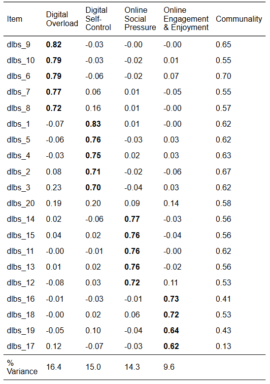

## Measurement Invariance (Week 9) Overview

### Learning Objectives

By the end of this tutorial & workshop, students will be able to:

1.  **Explain the purpose of measurement invariance (MI)** and why it is essential for group comparisons
2.  **Understand the statistical foundations of MI** within the CFA/SEM framework
3.  **Differentiate between levels of invariance** — configural, metric, scalar, and strict
4.  **Fit and compare multi-group CFA models** in `lavaan`
5.  **Evaluate invariance** using changes in fit and parameter estimates
6.  **Identify and address violations** using partial invariance approaches
7.  **Report MI analyses** clearly and transparently

### Structure

**Section 1: Lecture**

-   Part 1: Understanding Measurement Invariance — what it is, levels, and logic

**Section 2: Code Walkthrough**

-   Part 2: Testing Measurement Invariance — fitting and comparing models using `lavaan`

**Section 3: Worksheet**

-   Part 3: Exercises — apply invariance testing to the DLBS data

## Introduction

### Scale Development Process (Recap)

You may remember from previous weeks that developing a psychological scale is a multi-stage process that moves from theory to statistical testing and back again and that, generally speaking, it should follow these key phases:

1.  Define the construct

2.  Generate items

3.  Collect data

    a.  **Explore scale structure and remove problematic items (EFA)**

    b.  Evaluate internal consistency of the factors (reliability analysis)

4.  Collect new data (or split the EFA data and use the remaining portion)

    a.  **Evaluate the factor structure suggested by EFA using confirmatory factor analysis (CFA)**

    b.  **Evaluate whether the scale measures the same construct in the same way across groups (measurement invariance; MI)**

5.  Collect new data (ideal, but rare in practice)

    a.  Examine validity evidence (e.g., convergent/discriminant validity, criterion validity)

6.  Ongoing validity and generalisabilty checks (also rare in practice)

    a.  Evaluate and refine the scale across new samples, contexts, and time

This week, we're going to learn how to **evaluate** **whether the scale measures the same construct in the same way across groups using measurement invariance (MI)**.

## Part 1: Understanding Measurement Invariance

### Where This Fits in Scale Development

By this point, you’ve already done the heavy lifting of figuring out what your scale looks like and whether that structure holds up statistically.

In **EFA**, you asked: *“What structure is in the data?”.* You let the data speak, explored patterns, and identified a plausible factor structure.

In **CFA**, you tightened the screws and asked: *“Does this structure hold?”.* You specified a model based on theory (in this case, EFA) and tested whether it fits in a new dataset.

Now we move one step further and ask: **“Does this structure hold equally across different groups?”**

Up until now, you’ve only been asking whether your model works **in general**. Now you’re asking whether it works **fairly**.

This is measurement invariance — the *final boss* of the measurement model.

### Why Measurement Invariance Matters

Let’s start with the uncomfortable truth:

> **You cannot meaningfully compare groups unless your measure behaves the same way across them.**

That includes all the comparisons people love to make, such as:

-   Gender comparisons

-   Cultural comparisons

-   Year group comparisons

-   Intervention vs control

All of those hinge on a very strong assumption — usually untested — that the scale is operating equivalently across groups.

If that assumption is wrong, your conclusions are on shaky ground.

Without measurement invariance, differences in observed scores might reflect:

-   Different interpretations of items

-   Different response styles

-   Item bias

-   Or other measurement artefacts

...and not actual differences in the underlying construct. That is the slightly uncomfortable part.

Uncomfortable, because if we accept that and confront it, it have huge implications for our research.

You can have excellent global fit indices, strong factor loadings, and clean, interpretable factors, but still be comparing apples to something that looks like an apple but is psychologically an orange — that is, it is doing something completely different.

#### STARS Example

Let’s make this concrete using the STARS scale.

Imagine you want to compare statistics anxiety in two groups:

-   **Group A:** Neurotypical students

-   **Group B:** Neurodivergent students

You run your analysis and find neurodivergent students score higher.

Most researchers would simply conclude that "neurodivergent students experience more statistics anxiety". Nice. Clean. Publishable.

But… let’s slow that down for a second.

What if:

-   Some items are interpreted differently across groups (e.g., “interpreting a table” might tap different cognitive processes depending on how someone processes information)?

-   Certain items are more cognitively demanding for one group, independent of anxiety?

-   One group is more likely to use higher response categories, even at the same underlying level of anxiety?

Now ask yourself what that higher score is actually capturing?

It might not be *more anxiety*. It might be:

-   differences in processing style

-   differences in how items are understood

-   or systematic differences in how people respond to the scale

In other words, you are not necessarily comparing anxiety — you may be comparing how the measurement behaves across groups.

That’s the uncomfortable bit.

Without measurement invariance, you can’t tell whether observed group differences reflect real differences in the latent construct or differences in how the construct is being measured.

Measurement invariance is what lets you separate those two.

Without it, your interpretation is — at best — ambiguous, and at worst, just wrong.

### The Core Idea

If we strip everything back, measurement invariance is asking:

> **Can we use the same measurement model to explain relationships between variables in different groups?**

Because if we *can’t*, then:

-   the latent construct may not being measured in the same way

-   the scale may not operate equivalently

-   and group comparisons may be questionable

Exactly which of those are problems depends on the *level* of invariance.

### Levels of Invariance

Measurement invariance isn’t tested in one go.

Instead, we take a **stepwise approach**, gradually increasing how strict we are about equality across groups.

Each step asks a slightly stronger question than the last.

Think of it like turning up the pressure on your model and seeing when it starts to crack.

#### 1. Configural Invariance (Baseline Model)

At this stage, we are being deliberately relaxed.

-   Same factor structure across groups

-   No equality constraints

-   Everything (loadings, intercepts, residuals) is freely estimated

What are we testing?

> **Do the groups conceptualise the construct in the same basic way?**

In practical terms:

-   Do the same items cluster together?

-   Does the same factor structure make sense in each group?

We are not saying anything about *how strongly* items relate to the factor yet — just that the **overall pattern** is the same.

**If this fails, stop.** Because if different groups don’t even share the same conceptual structure, then you are not measuring the same construct and everything else becomes meaningless.

#### 2. Metric Invariance (Weak Invariance)

Now we start tightening things.

-   Factor loadings are constrained to be equal across groups

What are we testing?

> **Do items relate to the latent construct in the same way across groups?**

This is about **scale units**.

If an item is a strong indicator of the factor in one group, is it *equally strong* in another?

If metric invariance holds:

> A one-unit change in the latent construct means the same thing across groups.

That unlocks something important:

✔ You can compare **relationships** involving the construct (e.g., correlations, regressions, path models)

Why? Because the *scale of the latent variable is now comparable*.

Without metric invariance, even a simple correlation difference could just reflect different measurement properties.

#### 3. Scalar Invariance (Strong Invariance)

Now we add another layer of constraint:

-   Factor loadings **and** intercepts (or thresholds for ordinal data) are equal

What are we testing?

> **Do groups interpret the response scale in the same way?**

This is about **scale origin**.

Even if two people have the same level of the latent trait, do they:

-   endorse the same response category?

-   start from the same baseline?

If scalar invariance holds:

> The “zero point” (or baseline) of the scale is aligned across groups.

This is the big one.

✔ You can now compare **latent means**

And here’s the slightly uncomfortable truth:

> This is what most people *think* they’re doing when they compare group means — but usually without testing it.

Without scalar invariance, mean differences are ambiguous. They could reflect:

-   true differences in the construct

-   or systematic differences in how groups respond to items

#### 4. Strict Invariance

Now we go all in:

-   Loadings + intercepts + residual variances are equal

What are we testing?

> **Do items have the same measurement precision across groups?**

Residuals capture:

-   measurement error

-   item-specific variance not explained by the factor

If strict invariance holds:

> The scale is equally reliable across groups.

This allows:

✔ Comparison of **observed scores** (not just latent variables)

#### Reality Check

Strict invariance is:

-   Rarely achieved

-   Rarely necessary

If you demanded strict invariance for every study, you’d publish approximately nothing.

Most of the time:

-   **Scalar invariance is enough** for meaningful group comparisons

-   Everything beyond that is a bonus, not a requirement

Furthermore, when working with ordinal data using WLSMV, strict invariance is typically not tested. This is because residual variances are not freely estimated in the same way as in continuous models, meaning there are no additional parameters to constrain across groups. As a result, scalar invariance is usually considered the highest level of invariance assessed.

#### Partial Invariance

Full invariance is the textbook ideal. Partial invariance is the reality.

Partial invariance means that some parameters differ across groups, but enough are equal to still support meaningful comparisons

For example:

-   Most loadings are equal, but one item behaves differently

-   Most thresholds are equal, but one item is systematically endorsed differently

In practice, you:

1.  Identify non-invariant parameters

2.  Relax those specific constraints

3.  Re-fit the model

The key idea:

> You don’t throw the whole model out because of one problematic item.

### How This Links to CFA

This is not a new model. **This is just** **CFA, repeated across groups, with constraints added**.

So, everything you learned in the CFA section — especially:

-   model specification

-   covariance reproduction

-   parameter interpretation

…still applies here.

Measurement invariance just forces you to confront a harder question:

> **Not just “Does the model fit?” but “Does the model fit in the same way across groups?”**

### Statistical Foundations

You’ve already met the core idea behind CFA.

To recap:

> We are trying to explain the **covariance matrix** of the observed variables using a smaller number of latent factors.

In other words, CFA is not modelling raw scores — it is modelling **relationships between variables**.

Formally, this is done using the **common factor model**, which — as we've seen previously — generates the model-implied covariance matrix by combining the matrix of factor loadings (how items relate to factors), the covariance matrix of the latent factors (how factors relate to each other), and residual variance.

::: {.callout-note collapse="TRUE"}
##### Common Factor Model Equation

The model-implied covariance matrix is:

$$
\boldsymbol{\Sigma} = \boldsymbol{\Lambda} \boldsymbol{\Phi} \boldsymbol{\Lambda}^{\top} + \boldsymbol{\Theta}
$$

Where:

-   $\boldsymbol{\Sigma}$ = model-implied covariance matrix (what the model predicts)

-   $\boldsymbol{\Lambda}$ = matrix of factor loadings (how strongly items relate to factors)

-   $\boldsymbol{\Phi}$ = covariance matrix of the latent factors

-   $\boldsymbol{\Theta}$ = residual (error/unique variance) covariance matrix
:::

In other words, it is asking:

> **Can this combination of loadings, factor relationships, and residuals reproduce the covariance structure we observe in the data?**

If yes → the model fits (well enough).\
If no → something about the model (or theory) is off.

### Measurement Invariance Extends This Idea

Measurement invariance takes this exact logic and raises the stakes.

Instead of asking whether **one model fits one dataset**, we now ask:

> **Can the same model operate equivalently across multiple groups?**

This is a subtle but crucial shift. We are no longer just interested in *fit*. We are interested in **comparability**.

### The Multi-Group Extension

In measurement invariance, we estimate the model **separately for each group**, which gives us a group-specific covariance structure.

That is, for each group, we model the observed covariance matrix using that group’s matrix of factor loadings (how items relate to factors), the covariance matrix of the latent factors (how the factors relate to each other), and a residual covariance matrix capturing variance the model does not explain.

Every group is allowed to have its own CFA model.

::: {.callout-note collapse="TRUE"}
##### Group-Specific Covariance Matrix Equation

$$
\boldsymbol{\Sigma}_g = \boldsymbol{\Lambda}_g \boldsymbol{\Phi}_g \boldsymbol{\Lambda}_g^{\top} + \boldsymbol{\Theta}_g
$$

Where:

-   $g$ = group index (e.g., neurotypical vs neurodivergent students)

-   $\boldsymbol{\Sigma}_g$ = observed covariance matrix for group $g$

-   $\boldsymbol{\Lambda}_g$ = matrix of factor loadings for group $g$

-   $\boldsymbol{\Phi}_g$ = covariance matrix of the latent factors for group $g$

-   $\boldsymbol{\Theta}_g$ = residual covariance matrix for group $g$
:::

However, if all parameters are freely estimated across groups, we are *not* testing invariance — we are just fitting separate CFAs.

In this situation, each group has its own set of factor loadings, intercepts, and residuals, meaning the model is allowed to operate differently in each group. Although the same overall structure is specified, the actual parameter values can vary freely.

As a result, all we'd learn is that the model fits reasonably well within each group on its own, and that is not the same as showing the model is equivalent across groups...

### What Measurement Invariance Actually Tests

To test measurement invariance, we impose **equality constraints** on key parts of the model and examine whether the model still fits the data well.

This is what allows us to determine whether the measurement model is operating in the **same way across groups**, rather than simply fitting each group independently.

Instead of letting everything vary freely, we start asking a more demanding question:

> **What happens if we force certain aspects of the model to be the same across groups?**

For example:

-   Do items relate to the construct in the same way across groups?

-   Do groups interpret the response scale in the same way?

-   Do items have the same amount of measurement error?

Each of these corresponds to a different part of the model that we can choose to **constrain to be equal**.

The logic is simple but powerful:

-   If adding these constraints does **not** substantially worsen model fit → the model is operating equivalently across groups

-   If model fit **does worsen** → something about the measurement differs across groups

So, step by step, we move from a model where each group is estimated independently, towards models where more and more aspects of the measurement process are **shared across groups**.

## The Key Question

At its core, measurement invariance comes down to a practical decision:

> **What needs to be different across groups, and what can we reasonably assume is the same?**

In a multi-group CFA, we are fitting the same overall model to multiple groups. The crucial choice is:

-   Do we allow each group to have its **own version** of the model?

-   Or do we require parts of the model to be **shared across groups**?

More specifically:

-   Do we need different factor loadings (do items relate to the construct in the same way)?

-   Do we need different intercepts or thresholds (do groups use the response scale in the same way)?

-   Do we need different residual variances (is measurement error the same)?

Or:

> **Can we constrain these to be equal without breaking the model?**

If we can, that tells us something important:

> **The scale is operating equivalently across groups.**

::: {.callout-note collapse="TRUE"}
##### Measurement Invariance Testing Equations

We start with a model where **everything is freely estimated across groups**:

$$
\boldsymbol{\Sigma}_g = \boldsymbol{\Lambda}_g \boldsymbol{\Phi}_g \boldsymbol{\Lambda}_g^{\top} + \boldsymbol{\Theta}_g
$$

Here, each group has its own:

-   factor loadings ($\boldsymbol{\Lambda}_g$)

-   covariance matrix of the latent factors ($\boldsymbol{\Phi}_g$)

-   residual covariance matrix ($\boldsymbol{\Theta}_g$)

This is just **separate CFAs for each group**.

### Adding Constraints (Example: Metric Invariance)

We then begin constraining parameters across groups.

For example, if we constrain the factor loadings to be equal:

$$
\boldsymbol{\Sigma}_g = \boldsymbol{\Lambda} \boldsymbol{\Phi}_g \boldsymbol{\Lambda}^{\top} + \boldsymbol{\Theta}_g
$$

Now:

-   Factor loadings are the same across groups ($\boldsymbol{\Lambda}$)

-   Factor covariances ($\boldsymbol{\Phi}_g$) and residuals ($\boldsymbol{\Theta}_g$) can still vary

> **Note:** The model equation itself does not fundamentally change across levels of invariance. What changes is whether parameters carry a group-specific subscript (e.g., $\boldsymbol{\Lambda}_g$), meaning they are freely estimated in each group, or no subscript (e.g., $\boldsymbol{\Lambda}$), meaning they are constrained to be equal across groups. In other words, we are always fitting the same model — we are simply restricting how similar it must be across groups.

### Going Further (Example: Scalar Invariance)

If we also constrain intercepts (not shown in covariance form), we further restrict how the model operates across groups.

At each step:

> **We are testing whether the same parameter values can explain the covariance structure in all groups.**
:::

### The Logic of Testing

Measurement invariance is tested by comparing:

-   A model where parameters are **free across groups**

-   A model where some parameters are **constrained to be equal**

If model fit does not meaningfully worsen:

> The constrained parameters are invariant across groups.

We fit models sequentially:

1.  Configural

2.  Metric

3.  Scalar

And compare them.

We’re not asking:

> “Is the model perfect?”

We’re asking:

> **“Does adding constraints make things meaningfully worse?”**

### How Do We Decide?

You *could* use chi-square difference tests.

But with large samples (like STARS), they will almost always say:

> ❌ “Everything is significantly worse”

So instead, we look at **changes in fit indices**:

-   ΔCFI ≤ .01

-   ΔRMSEA ≤ .015

-   ΔSRMR ≤ .030 (metric), ≤ .015 (scalar)

These are rules of thumb — not commandments.

### What Changes with Ordinal Data?

-   Use **WLSMV**

-   Intercepts are replaced by **thresholds**

    -   If thresholds differ then groups use response categories differently

    -   So, the same observed score ≠ same latent trait

### Assumptions & Data Requirements

**Same as CFA**

-   Correct model

-   Independent observations

-   Adequate sample size

-   Meaningful covariances

**Additional for MI**

-   Sufficient N per group

-   Comparable group distributions

-   Same response scale functioning

## Part 2: Testing Measurement Invariance in R

### Process Overview

This mirrors CFA — just with more constraints.

#### Step 0: Pre-Analysis Checks

Everything from CFA still applies, **plus:**

-   Adequate sample size **per group**

-   Reasonable group balance

-   Same model fits *within each group*

#### Step 1: Fit Baseline CFA

-   Check baseline CFA model is a good fit (otherwise MI is pointless)

#### Step 2: Fit Configural Model

#### Step 3: Add Constraints Sequentially

1.  Metric

2.  Scalar

3.  Strict (optional)

#### Step 4: Compare Models

-   Fit index changes

-   Parameter changes

-   Substantive interpretation

#### Step 5: Report

-   In-text

-   Tables

### The Statistics Anxiety Rating Scale (STARS)

Let's go through each of these steps using the same STARS data and CFA model from CFA week.

Here's a reminder of the measurement model (minus stars_help_1):


This time our research question is:

> **Does the STARS measures the same construct in the same way in the original English vs. the non-English versions?**

(IRL, we'd usually want to look at this language-by-language, but we're collapsing languages for educational reasons.)

### Step 0: Pre-Analysis Checks

Before testing measurement invariance, all the usual CFA pre-analysis checks still apply (we won't revisit them again now though). However, because we are now working with **multiple groups**, there are a few additional requirements to consider.

#### Adequate Sample Size Per Group

It’s not enough for the total sample to be large — each group must have sufficient cases to estimate the model reliably. A model that works well overall can break down within smaller subgroups.

There is no universal minimum sample size per group for measurement invariance testing. However, some **practical guidelines** are useful:

-   **\~100–200 per group** → Often adequate for **simple, well-behaved models** (few factors, strong loadings)

-   **\~200–500 per group** → Safer for most applied CFA/MI work

-   **500+ per group** → Preferred for **ordinal data with WLSMV** or more complex models

That said, these are **rules of thumb, not guarantees**. See the call-out below for more information.

::: {.callout-note collapse="TRUE"}
##### How Large Should Each Group Be?

There is no universal minimum sample size per group for measurement invariance testing. Required sample size depends on:

-   **Model complexity** (number of factors, items, and parameters)

-   **Strength of factor loadings** (stronger loadings need fewer cases)

-   **Estimator used** (e.g., WLSMV typically needs larger samples than Maximum Likelihood)

However, some **practical guidelines** are useful:

-   **\~100–200 per group** → Often adequate for **simple, well-behaved models** (few factors, strong loadings)

-   **\~200–500 per group** → Safer for most applied CFA/MI work

-   **500+ per group** → Preferred for **ordinal data with WLSMV** or more complex models

That said, these are **rules of thumb, not guarantees**.

A better way to think about it is:

> **Do I have enough data in each group for the model to converge, produce stable estimates, and show acceptable fit?**

Rather than relying on fixed cut-offs, you should:

1.  **Fit the model separately in each group**

    -   Does it converge?

    -   Are the loadings sensible (e.g., not tiny, not \> 1)?

    -   Are standard errors reasonable?

2.  **Check model fit within each group**

    -   If the model fits well in large groups but poorly in small ones, that’s a red flag for sample size issues.

3.  **Watch for warning signs of too-small samples**

    -   Non-convergence

    -   Heywood cases (negative variances)

    -   Huge standard errors

    -   Unstable fit indices
:::

#### Reasonable Group Balance

Extremely unequal group sizes can cause problems for estimation and model comparison. Invariance testing relies on comparing model fit across groups, so if one group dominates the sample, results may be misleading or unstable.

There is no strict rule for acceptable group balance, but a useful way to think about this is in terms of **ratios between groups**:

-   **Up to \~2:1** → Generally fine

-   **Around 3:1–5:1** → Usually acceptable, but proceed with caution

-   **\> 5:1–10:1** → Potentially problematic

-   **Extreme imbalance (e.g., 10:1+)** → Likely to distort results

See the call-out below for more information.

::: {.callout-note collapse="TRUE"}
##### How Imbalanced is Too Imbalanced?

What you’re really asking is: “When does imbalance start to meaningfully distort estimation and comparisons?”.

The honest answer is: when it starts breaking things!

There is no strict rule for acceptable group balance, but a useful way to think about this is in terms of **ratios between groups**:

-   **Up to \~2:1** → Generally fine

-   **Around 3:1–5:1** → Usually acceptable, but proceed with caution

-   **\> 5:1–10:1** → Potentially problematic

-   **Extreme imbalance (e.g., 10:1+)** → Likely to distort results

**Why Does Imbalance Matter?**

In multi-group CFA, the model is estimated **simultaneously across groups**, but:

-   Larger groups contribute **more information**

-   Fit indices and parameter estimates are **dominated by the largest group**

-   Smaller groups can become **statistically “invisible”**

This creates a situation where:

> The model can appear to fit well overall, even if it fits poorly in the smaller group.

Even worse, **invariance decisions (ΔCFI, ΔRMSEA, etc.) may reflect the large group almost entirely**, masking meaningful differences.

**How Do You Actually Diagnose a Problem?**

Don’t rely on ratios alone — check behaviour:

1.  **Fit the model separately in each group**

    -   Does the small group show worse fit or instability?

2.  **Compare parameter estimates across groups**

    -   Are loadings wildly different in the smaller group?

    -   Are standard errors much larger?

3.  **Look for instability in the smaller group**

    -   Non-convergence

    -   Large SEs

    -   Odd estimates (e.g., near-zero or inflated loadings)
:::

#### The Same Model Fits Within Each Group

Before testing invariance, you need evidence that the basic measurement model is plausible in each group separately. This is typically done by fitting the model **independently within each group** and checking model fit and parameter estimates.

If the model fits poorly in one group, invariance testing becomes meaningless — you are effectively comparing a well-fitting model to a poorly fitting one.

In this situation, lack of invariance may reflect **model misspecification in one group**, rather than genuine differences in how the construct operates across groups.

In practice, you should check:

-   **Model fit within each group** (e.g., CFI/TLI, RMSEA, SRMR)

-   **Factor loadings** (are they reasonably strong and in the expected direction?)

-   **Any estimation problems** (e.g., non-convergence, large standard errors, negative variances)

If the model does not fit adequately in all groups, you should **revise the measurement model** before proceeding — not attempt to “fix” the problem through invariance testing.

#### 🤔 Does our data pass the pre-analysis sample size & ratio checks?

Let's address the group sample size and ratio first.

First, we need to read in the data (I've already removed the `stars_help_1` item that we previously dropped as it was redundant).

```{r}
#| message: false
#| warning: false
stars_data <- readr::read_csv(here::here("data/stars_mi_data.csv"))
```

Then, to get our group sample size, we need to count how many participants are in each group.

We can do that with a quick count:

```{r}
stars_data |> dplyr::count(language)
```

Then we need to calculate the ratio.

Essentially, we just need to divide the number in the English language group by the number in the non-English language group.

We can do that with the following code:

```{r}
stars_data |>
  dplyr::count(language) |>
  dplyr::summarise(
    ratio = n[language == "English"] / n[language == "Non-English"]
  )
```

::: {.callout-tip collapse="true"}
##### Solution

✔️ Our group sample sizes are very large

✔️ Our group sample size ration is 1.13:1, which is pretty good
:::

#### 🤔 Does our data pass the pre-analysis individual group model fit checks?

To check this, we need to specify the measurement model and then run the CFA in each group using split samples.

(This is very similar to what we did last week and to the next step \[configural invariance\], so we won't complete all these steps in the workshop, but the detail is here for future reference and is an excuse to show you some more advanced R code.)

**Specify the measurement model:**

```{r}
stars_model <- '

interpret =~ stars_int_3 + stars_int_11 + stars_int_1 +
             stars_int_6 + stars_int_5 + stars_int_2

test =~ stars_test_3 + stars_test_6 + stars_test_4 +
        stars_test_1 + stars_test_8

help =~ stars_help_2 + stars_help_3 + stars_help_4

'
```

**Split the sample and fit the CFA models:**

There are various ways to do this, but I've opted to show you an efficient and reproducible solution that uses more advanced code than what you'll have encountered on the course so far. Probably.

This code fits the same CFA model separately within each group by filtering the dataset, estimating the model independently, and storing the results in a named list for comparison.

```{r}
item_vars <- c( #<1>
  "stars_int_3", "stars_int_11", "stars_int_1",
  "stars_int_6", "stars_int_5", "stars_int_2",
  "stars_test_3", "stars_test_6", "stars_test_4",
  "stars_test_1", "stars_test_8",
  "stars_help_2", "stars_help_3", "stars_help_4"
)

groups <- unique(stars_data$language) #<2>

fits <- purrr::map(groups, ~ { #<3>
  
  stars_grouped <- stars_data |>
    dplyr::filter(language == .x) |> #<4>
    dplyr::select(dplyr::all_of(item_vars)) #<5>
  
  lavaan::cfa( #<6>
    model = stars_model,
    data = stars_grouped,
    estimator = "WLSMV",
    ordered = item_vars
  )
  
}) |>
  rlang::set_names(groups) #<7>
```

1.  Defines a **character vector of item variable names** to be used in the CFA.
2.  Extracts the **unique group labels** (i.e., `"English"`, `"Non-English"`) which we will use to loop over each group separately
3.  Applies a function that loops over each group in `groups` — `.x` represents the **current group value** (e.g., `"English"`); `map()` will return a **list of fitted models** (one per group)
4.  Filters the dataset to **only include one group at a time** (e.g., only English participants)
5.  Keeps **only the scale items** used in the CFA (as listed in `item_vars`) to prevent grouping variables or other columns from entering the model
6.  Fits our CFA model (as per CFA week)
7.  Assigns **names to each model in the list** to make the output easier to interpret (e.g., `"English"`, `"Non-English"` instead of `[[1]]`, `[[2]]`)

**Compare model fit for each group:**

This code extracts key fit statistics from each group-specific CFA model and combines them into a single table, making it easy to compare how well the model fits in each group.

```{r}
fit_summary <- fits |> 
  purrr::map_dfr( #<1>
    ~ lavaan::fitMeasures(.x, #<2>
      c("cfi", "tli", "rmsea", "srmr")
    ),
    .id = "group" #<3>
  )

fit_summary
```

1.  Applies a function to each model in the list and returns the results as a **data frame** (instead of a list); `_dfr` = “map + bind rows”
2.  Extracts the specified **fit indices** for each group
3.  Adds a column called `"group"` using the names of the `fits` list (e.g., `"English"`, `"Non-English"`) to allow you to **identify which row corresponds to which group**

::: {.callout-tip collapse="true"}
##### Solution

**Is model fit acceptable *within each group*?**

✔️ The model (hypothesised factor structure) fits well in both groups

However...

-   Non-English fits **slightly better**

-   English fits **slightly worse**

-   But the differences are **small:**

    -   ΔCFI ≈ .003 → trivial

    -   ΔRMSEA ≈ .015 → noticeable but not dramatic

This could be due to:

-   Sampling variation (e.g., one group might be more heterogeneous, noisier, or a little less consistent in responses)

-   Model misspecification (e.g., one group may have one item behaving different,a residual correlation exists in one group only, a loading is weaker)

-   Non-invariance (but this is a flag, not a diagnosis — we need model constraints for that)
:::

**Compare factor loadings for each group:**

This code extracts the factor loadings from each group-specific CFA model and combines them into a single table, allowing you to assess the strength and consistency of item–factor relationships across groups.

```{r}
loadings <- fits |>
  purrr::map_dfr( #<1>
    ~ lavaan::parameterEstimates(.x, standardized = TRUE) |> #<2>
      dplyr::filter(op == "=~") |> #<3>
      dplyr::select(lhs, rhs, est, std.all), #<4>
    .id = "group" #<5>
  )

loadings
```

1.  Applies a function to each model and combines the results into a single **data frame**;`_dfr` = map + bind rows
2.  Extracts all parameter estimates from each model — `standardized = TRUE` adds **standardised estimates** (`std.all`; these are easier to interpret than raw (unstandardised) values)
3.  Keeps only **factor loadings** (`=~` indicates relationships between latent variables and their indicators)
4.  Keeps only **relevant columns** — `lhs`: latent factor, `rhs`: observed item, `est`: unstandardised loading, `std.all`: standardised loading
5.  Adds a column **identifying the** **group** for each row usingthe names from the `fits` list

::: {.callout-tip collapse="true"}
##### Solution

**Are factor loadings reasonably strong and in the expected direction *within each group*?**

✔️ Yes - quite clearly

Across both groups:

-   Most loadings are **.75–.90** → **strong**

-   A few are around **.60–.70** → **very** **acceptable but weaker**

Meaning:

-   Items are clearly related to their factors

-   Each factor is well-defined by its indicators
:::

**Check for estimation issues in each group:**

This code checks for common estimation problems (e.g., negative variances, unstable estimates) in each group-specific model, helping ensure that the results can be trusted before proceeding to invariance testing.

If the resulting table isn’t empty, something’s off — don’t just ignore it and carry on.

```{r}
issues <- fits |> #<1>
  purrr::map_dfr( #<2>
    ~ lavaan::parameterEstimates(.x) |> #<3>
      dplyr::filter( #<4>
        est < 0 & op == "~~" | #<5>  
        se > 10 |      #<6>              
        abs(est) > 10  #<7>             
      ),
    .id = "group" #<8>
  )

issues
```

1.  Starts with the list of fitted CFA models (`fits`); each model corresponds to a different group
2.  Applies a function to each model and combines results into a single **data frame**; `_dfr` = map + bind rows
3.  Extracts all **parameter estimates** from each model (includes loadings, variances, covariances, thresholds, etc.)
4.  Filters the output
5.  Flags **negative variances** (Heywood cases); `~~` refers to variances/covariances
6.  Flags **very large standard errors**
7.  Flags **implausibly large parameter estimates**
8.  Adds a column identifying which group the issue comes from (helps pinpoint **group-specific estimation problems**)

::: {.callout-tip collapse="true"}
##### Solution

✔️ There are no convergence issues, warnings, or Heywood cases
:::

### Step 1: Configural Model

The key question at this stage is **whether the same measurement model can be meaningfully applied across groups**.

Although we have already fitted the model separately in each group, this does **not** test measurement invariance. Separate CFAs simply tell us that the model fits reasonably well within each group in isolation. They do not tell us whether the model is operating in a comparable way across groups.

Configural invariance is the first step that brings the groups together into a **single multi-group model**. Here, we specify the same factor structure in each group, but allow all parameters (loadings, intercepts/thresholds, residuals) to be freely estimated. In other words, the *form* of the model is held constant, but the *values* are allowed to differ.

This allows us to test a more meaningful question:

>  **Can the same conceptual model explain the data across groups when estimated simultaneously?**

This step is necessary because good fit in separate groups can be misleading. A model might fit each group individually, but still reflect different underlying patterns of relationships. By estimating the model jointly, the configural model evaluates whether a common structure is plausible across groups.

In practical terms, we assess:

-   Overall model fit in the multi-group model (global fit)

-   Whether the same pattern of factor–item relationships is supported across groups (local fit)

If the configural model fits well, this suggests that participants across groups conceptualise the construct in a broadly similar way, providing a foundation for more restrictive tests of invariance.

If it does not fit well, this indicates that the basic structure is not comparable across groups, and invariance testing should not proceed.

We can test this by:

1.  Converting our grouping variable to a factor (to ensure `lavaan` handles it correctly)

2.  Specifying our measurement model (we already done that in the last step)

3.  Specifying a vector of our ordinal item variables (we already done that in the last step too)

4.  Fitting the configural model

5.  Calling a summary of the output

**Convert our grouping variable to a factor:**

This ensures `lavaan` treats it as a grouping variable rather than numeric or character (required for multi-group CFA):

```{r}
stars_data <- stars_data |>
  dplyr::mutate(language = forcats::as_factor(language))
```

**Fit the configural invariance model:**

Then fit a configural invariance model, testing whether the same factor structure holds across groups without imposing any equality constraints (yet).

```{r}
fit_configural <- lavaan::cfa(
  model = stars_model,
  data = stars_data,
  group = "language", #<1>
  estimator = "WLSMV",
  ordered = item_vars
)

lavaan::summary(fit_configural, fit.measures = TRUE, standardized = TRUE)
```

1.  Tells `lavaan` to fit a **multi-group model** based on the `language` variable (all the other code is the same as our previous CFAs)

#### 🤔 Can the same measurement model can be meaningfully applied across groups?

::: {.callout-tip collapse="true"}
##### Solution

✔️ The configural model shows acceptable fit across groups, with strong and consistent factor loadings and no estimation problems. This suggests that the same factor structure is plausible in both groups, providing a suitable baseline for testing measurement invariance.

Specifically:

1.  The model ran properly ("*lavaan ended normally after 42 iterations")*
2.  Overall model fit was acceptable (CFI ≈ .95; TLI ≈ .94; RMSEA ≈ .08; SRMR ≈ .045)
3.  Group specific χ² showed different levels of misfit across groups (Non-English: χ² ≈ 2208; English: χ² ≈ 1633), but nothing dramatic or alarming
4.  Factor loadings are mostly strong (.75–.90) and all are positive so items are good indicators of their factors in both groups, and the measurement structure is consistent (if they weren't you should consider removing problematic items)
5.  Factor correlations are moderate to strong (\~.60–.65), so are related but distinct
6.  Thresholds were successfully estimated (you’re not interpreting them yet — just confirming the model behaves)
7.  Residual variances are all positive (no Heywood cases)

The same factor structure can be estimated across groups without imposing equality constraints. This supports configural invariance, indicating that the construct has a similar conceptual meaning in both groups.

At this stage, we can conclude that **the overall pattern of relationships between items and factors is consistent across groups**. However, comparisons of relationships or means are not yet meaningful, as the scale of the construct may still differ between groups.
:::

### Step 2: Metric Invariance

The key question at this stage is **whether the relationships between items and their underlying factors are equivalent across groups**.

Metric invariance tests whether factor loadings can be constrained to be equal across groups, meaning that each item contributes to the latent construct to the same extent in each group. This is important because it determines whether the construct has the same meaning across groups.

To evaluate this, we fit a multi-group CFA model in which factor loadings are constrained to be equal across groups, while other parameters remain freely estimated. We then compare this model to the configural model using changes in fit indices.

If model fit does not deteriorate substantially, this supports metric invariance, indicating that the items relate to the latent variables in a comparable way across groups. However, if model fit worsens notably, this suggests that some items function differently across groups, and full metric invariance may not hold. In such cases, it may be necessary to identify and relax constraints on specific loadings.

```{r}
fit_metric <- lavaan::cfa(
  model = stars_model,
  data = stars_data,
  group = "language",
  group.equal = "loadings", #<1>
  estimator = "WLSMV",
  ordered = item_vars
)

lavaan::summary(fit_metric, fit.measures = TRUE, standardized = TRUE)
```

1.  This argument constrains the loadings to be equal. Otherwise our code is as per the configural model.

#### 🤔 Are the relationships between items and their underlying factors are equivalent across groups?

::: {.callout-tip collapse="true"}
##### Solution

✔️ The metric invariance model shows acceptable fit, with only minimal changes relative to the configural model. This suggests that factor loadings can be considered equal across groups, meaning the constructs are measured in the same way in both groups.

Specifically:

1.  The model ran properly (*“lavaan ended normally after 42 iterations”*)

2.  Equality constraints were successfully applied (11 loadings constrained equal across groups)

3.  Model fit remains very similar - changes are tiny and well within recommended thresholds (more on this later). In other words, adding equality constraints on loadings **did not meaningfully worsen model fit**, supporting metric invariance.

    -   Robust CFI ≈ .951 (previously ≈ .952)

    -   Robust TLI ≈ .944 (previously ≈ .941)

    -   Robust RMSEA ≈ .078 (previously ≈ .080)

    -   SRMR ≈ .046 (previously ≈ .045)

4.  Group specific χ² showed different levels of misfit across groups (Non-English: χ² ≈ 1779; English: χ² ≈ 1323), but nothing dramatic or alarming (or new)

5.  Factor loadings are now **constrained equal across groups** so we don't need to interpret them (we know they'll be the same) — in this model we're interpretting the model fit to see if forcing equal loadings reduces model fit substantially (if it does, it suggests loadings aren't equal).

6.  Factor correlations, thresholds, and residual variances are all interpreted as before.

Imposing equality constraints on factor loadings does not meaningfully reduce model fit. This supports metric invariance, indicating that the relationship between items and the latent construct is equivalent across groups.

At this stage, **relationships involving the latent variables (e.g., correlations or regressions) can be meaningfully compared across groups**, as the construct is measured on the same scale. However, comparisons of latent means are not yet appropriate.
:::

### Step 3: Scalar Invariance

The key question at this stage is whether **group differences in observed scores reflect true differences in the underlying constructs**.

Scalar invariance tests whether item thresholds (for ordinal data) can be constrained to be equal across groups, in addition to factor loadings. This ensures that individuals with the same level of the latent trait have the same expected responses, regardless of group membership.

To evaluate this, we fit a model in which both loadings and thresholds are constrained to equality across groups, and compare it to the metric model using changes in fit indices.

If model fit remains acceptable, this supports scalar invariance and allows for meaningful comparisons of latent means across groups. However, if model fit deteriorates, this indicates that some items may be systematically easier or harder to endorse in one group than another. In such cases, partial invariance may be considered by freeing selected thresholds.

```{r}
fit_scalar <- lavaan::cfa(
  model = stars_model,
  data = stars_data,
  group = "language",
  group.equal = c("loadings", "thresholds"), #<1>
  estimator = "WLSMV",
  ordered = item_vars
)

lavaan::summary(fit_scalar, fit.measures = TRUE, standardized = TRUE)
```

1.  This argument constrains the loadings and thresholds to be equal. Otherwise our code is as per the metric model.

#### 🤔 Do group differences in observed scores reflect true differences in the underlying constructs?

::: {.callout-tip collapse="true"}
##### Solution

✔️ The scalar invariance model shows acceptable (though slightly reduced) fit, with only small changes relative to the metric model. This suggests that thresholds can be considered approximately equal across groups, allowing for meaningful comparisons of latent means.

Specifically:

1.  The model ran properly (*“lavaan ended normally after 62 iterations”*)

2.  Equality constraints were successfully applied (67 constraints: loadings + thresholds constrained equal across groups)

3.  Model fit (compared to metric) remains very similar overall, with only small deterioration. In other words, adding equality constraints on thresholds did not meaningfully worsen model fit, supporting scalar invariance.

    -   Robust CFI ≈ .953 (previously ≈ .951)

    -   Robust TLI ≈ .954 (previously ≈ .944)

    -   Robust RMSEA ≈ .081 (previously ≈ .078)

    -   SRMR ≈ .045 (previously ≈ .046)

4.  Group specific χ² showed different levels of misfit across groups (Non-English: χ² ≈ 2207; English: χ² ≈ 1638), but nothing dramatic or alarming (or new)

5.  Factor loadings are now constrained equal across groups so we don't need to interpret them (we know they'll be the same) — in this model we're interpretting the model fit to see if forcing equal loadings reduces model fit substantially (if it does, it suggests loadings aren't equal).

6.  Thresholds are now also constrained to be equal across groups and, again, aren't interpreted individually. Rather, the fact that model fit remains acceptable suggests that response category boundaries operate similarly across groups.

7.  Factor correlations, thresholds, and residual variances are all interpreted as before.

Imposing equality constraints on both loadings and thresholds does not meaningfully reduce model fit. This supports scalar invariance, indicating that individuals with the same level of the latent construct respond to items similarly across groups.

At stage, **differences in observed scores can be interpreted as reflecting true differences in the underlying constructs**, allowing for meaningful comparisons of latent means across groups.
:::

### Step 4: Compare Models

The key question at this stage is **whether adding equality constraints leads to a meaningful deterioration in model fit**.

Measurement invariance is evaluated by comparing increasingly constrained models (configural, metric, scalar, and strict) to determine whether the added constraints are tenable. Rather than focusing on absolute fit, the emphasis is on **changes in model fit** between successive models.

To evaluate this, we compare models using changes in fit indices such as CFI and RMSEA. Small changes in these indices suggest that the constraints do not substantially worsen model fit, supporting invariance at that level. As a general guideline, a decrease in CFI of less than .01 and an increase in RMSEA of less than .015 are often taken as evidence that invariance holds.

In addition to overall fit indices, it is also important to consider parameter changes and the substantive meaning of the constraints. For example, if imposing equality constraints leads to noticeable shifts in loadings or thresholds, this may indicate that items function differently across groups, even if global fit indices appear acceptable.

If model fit remains stable as constraints are added, this supports the conclusion that the measurement model operates equivalently across groups at that level of invariance. However, if model fit deteriorates substantially, this suggests that the assumption of invariance is violated. In such cases, it may be appropriate to explore partial invariance by relaxing specific constraints rather than abandoning the analysis entirely.

```{r}
lavaan::anova(fit_configural, fit_metric, fit_scalar)
```

```{r}
lavaan::fitMeasures(fit_configural, c("cfi", "tli", "rmsea", "srmr"))
lavaan::fitMeasures(fit_metric, c("cfi", "tli", "rmsea", "srmr"))
lavaan::fitMeasures(fit_scalar, c("cfi", "tli", "rmsea", "srmr"))
```

🤔 **Does adding equality constraints lead to a meaningful deterioration in model fit?**

::: {.callout-tip collapse="true"}
##### Solution

**Overall Interpretation**

✔️ Model comparisons provide **strong support for** **scalar invariance**, despite the chi-square test suggesting some differences at earlier stages.

Specifically:

The scaled chi-square difference test comparing the **configural and metric models** is statistically significant (Δχ² ≈ 47.22, df = 11, *p* \< .001), which would traditionally suggest that constraining loadings worsens model fit.

However, this needs to be interpreted with caution:

-   Chi-square tests are highly sensitive to large sample sizes (and ours is *very* large)

-   Even trivial differences can become statistically significant

So we turn to practical fit indices instead.

Fit index comparison:

Model fit remains **extremely stable across all models**:

-   **CFI**: .994 → .994 → .994

-   **TLI**: .993 → .993 → .994

-   **RMSEA**: .065 → .064 → .059

-   **SRMR**: .045 → .046 → .045

Changes are tiny and well within recommended thresholds (e.g., ΔCFI \< .01)

In fact, if anything, fit slightly *improves* as constraints are added (which is always a bit suspicious, but not uncommon with WLSMV).

**Metric Invariance**

Although the chi-square difference test is significant:

-   Changes in CFI, TLI, RMSEA, and SRMR are negligible

-   There is no meaningful deterioration in model fit

✔️ This supports **metric invariance**, meaning factor loadings can be treated as equal across groups.

This indicates that:

> The constructs are measured in the same way across groups (**metric invariance**)

**Scalar Invariance**

The comparison between the **metric and scalar models** is *not* statistically significant (Δχ² ≈ 39.19, df = 28, *p* ≈ .078).

-   This indicates that adding equality constraints on thresholds does **not** significantly worsen model fit

Combined with:

-   Essentially unchanged fit indices

✔️ This supports **scalar invariance**

Imposing equality constraints on loadings and thresholds does not meaningfully reduce model fit.

This indicates that:

> Individuals with the same level of the latent construct respond similarly to items across groups (**scalar invariance**)

👉 **Taken together, differences in observed scores can be interpreted as reflecting true differences in the underlying constructs, allowing for meaningful comparisons of latent means across groups.**
:::

::: {.callout-note collapse="TRUE"}
##### ⚠️ Partial Invariance: When Invariance Is *Not* Supported

Sometimes, invariance testing doesn’t behave nicely. You add constraints and suddenly model fit drops, chi-square screams, and your neat cross-group comparison starts looking questionable.

Full invariance assumes that **all parameters** (e.g., loadings or thresholds) are identical across groups. That's often unrealisitic in practice.

A small number of items frequently behave differently across groups — e.g., due to wording, cultural interpretation, or just statistical noise.

Partial invariance allows **some parameters to vary**, while keeping most constraints in place.

The key question at this stage is **whether a small number of non-invariant parameters can be accommodated without undermining the overall comparability of the model**.

To evaluate this, we examine model comparisons and, if invariance is not supported, inspect **score tests** to identify which constraints are contributing most to model misfit. We then free these parameters one at a time and re-estimate the model.

If model fit improves and the majority of parameters remain invariant, partial invariance may be considered acceptable. This allows meaningful comparisons to proceed, provided that enough parameters are still constrained to anchor the scale.

However, if too many parameters need to be freed, or if (theoretically) key items show non-invariance, this suggests that the construct may not be operating equivalently across groups. In such cases, comparisons should be interpreted with caution or reconsidered altogether.

> Partial invariance is not a workaround for a poor model, but a pragmatic recognition that small differences between groups are often unavoidable.

**How many freed parameters is too many?**

Partial invariance is acceptable when most parameters remain equal across groups and each factor retains at least two invariant items. However, if many parameters must be freed or non-invariance is concentrated within a factor, this suggests the construct may not be comparable across groups.

> Invariance testing is not about finding a “perfect” model, but about determining how much equality can be reasonably assumed across groups without distorting the measurement of the construct.

**How to Identify Problems**

Score tests evaluate whether the equality constraints imposed in an invariance model are tenable.

Specifically, they test:

> Would freeing each constrained parameter (e.g., a loading or threshold) significantly improve model fit?

Each test considers one constraint at a time. A significant result suggests that the parameter may differ across groups and that the equality constraint is contributing to model misfit.

```{r}
lavaan::lavTestScore(fit_scalar)
```

**What does the overall test mean?**

The overall score test evaluates all constraints simultaneously.

In this case: *X*²(67) = 101.39, *p* = .004

This tests the null hypothesis that *all constrained parameters are equal across groups.*

Since the test is significant, we reject this hypothesis, indicating that **at least some equality constraints are violated.**

**Interpreting this in Practice (especially with large samples):**

With large samples (as here), score tests are **highly sensitive**. This means they can detect:

-   very small differences between groups

-   even when those differences have negligible impact on overall model fit

So, a significant result does **not necessarily mean** that invariance has meaningfully failed.

Instead, it often reflects **minor deviations from perfect equality rather than substantively important differences.**

The individual score tests allow us to explore that further.

**What do the individual score tests mean?**

The output from `lavTestScore()` also provides a **separate test for each equality constraint** in the model.

Each row tests: *Does this specific parameter differ across groups?*

A significant result indicates that **freeing that parameter would improve model fit**, suggesting potential non-invariance.

**Step 1: Focus on Effect Size, Not Just *p*-values**

With large samples (which most MI samples are!), many parameters will be statistically significant even if differences are trivial.

Instead of focusing only on *p*-values, prioritise:

-   **Large score test statistics (*X*² values)**

    -   Rough guide:

        -   \~3–5 → small

        -   \~5–10 → moderate

        -   **\>10 → potentially meaningful**

-   **Consistency across parameters** — i.e., issues cluster within a factor or the same item appearing repeatedly

-   **Substantive plausibility** — does it make theoretical sense that this item behaves differently?

**Step 2: Which Parameters Should You Free?**

Only consider freeing parameters that are:

-   already in the model (e.g., loadings `=~`, thresholds `|`)

-   strongly supported by the score tests (large *X*²)

-   part of a **clear, interpretable pattern**, not isolated noise

Avoid:

-   freeing many parameters at once (free one at a time and check the impact before freeing another)

-   freeing parameters purely based on *p* \< .05

Do not chase every significant constraint — focus on the few that meaningfully affect the model.

**What do the individual tests for *our model* show?**

Most parameters:

-   have very small X² values

-   are non-significant

-   or fall in the trivial range

However, a small number stand out (larger violations, X² \> 10):

-   `.p6.` → 32.35

-   `.p11.` → 15.42

-   `.p5.` → 12.75

-   `.p15.` → 13.29

-   `.p38.` → 12.98

-   `.p55.` → 11.80

-   `.p36.` → 10.34

These suggest **some non-invariance**, but importantly:

-   they are **few in number**

-   they are **not obviously concentrated within a single factor or item** (pending mapping)

**Step 2: Map Parameter Labels to Model Terms**

`lavaan` reports constraints using internal labels (e.g., `.p6. == .p127.`), which correspond to the same parameter across groups.

To identify the actual parameter (using `.p.6` as an example):

```{r}
params <- lavaan::parameterEstimates(fit_scalar)

params |>
  dplyr::select(lhs, op, rhs, label) |>
  dplyr::filter(label == ".p6.")
```

This tells us that `.p.6` represents the parameter: `interpret =~ stars_int_2`, aka the loading of `stars_int_2` on the `interpretation anxiety` factor.

It would be worth mapping the other parameters to see whether there are consistent problems in a given factor, but otherwise, there wouldn't be a strong case for removing any items here.

**Putting this in Context**

Crucially, earlier model comparisons showed:

-   negligible changes in CFI, RMSEA, and SRMR

-   non-significant χ² difference between metric and scalar models

This means:

> Constraining these parameters does not meaningfully worsen model fit

**What if there *was* an issue with a particular item?**

In practice, it is common for a small number of parameters to show evidence of non-invariance. The key question is:

> Are these differences large enough to matter?

If only a small number of parameters are problematic, we can allow for partial invariance by freeing those specific constraints.

**How to Implement Partial Invariance**

To be clear, we don't really need to do this, but if we did want to allow partial invariance, this is how you'd do it.

Free only the clearly problematic parameter(s):

```{r}
#| message: false
#| warning: false
fit_partial <- lavaan::cfa(
  model = stars_model,
  data = stars_data,
  group = "language",
  group.equal = c("loadings", "thresholds"),
  group.partial = c("interpret=~stars_int_2"), #<1>
  estimator = "WLSMV",
  ordered = item_vars
)

lavaan::summary(fit_partial, fit.measures = TRUE, standardized = TRUE)
```

1.  Frees the `interpret =~ stars_int_2` parameter. Otherwise, all code is as per the scalar model.

**Interpretation**

After freeing the loading for `interpret =~ stars_int_2`:

-   Model fit improves slightly (*χ*² decreases from 2413.61 → 2381.16; df decreases by 1)

-   Fit indices remain essentially unchanged (CFI ≈ .974, RMSEA ≈ .075, SRMR ≈ .045)

-   The model still shows acceptable fit overall

Crucially:

-   Only **one parameter** was freed

-   The rest of the measurement model remains constrained and stable

**Conclusion:** Comparisons across groups are still valid. The scale is functioning similarly across groups, with only a minor deviation for one item.

This is a textbook example of partial invariance working as intended.

**Should we remove the item instead?**

In this case, **no — and this is exactly the situation where people are tempted to overreact.**

Freeing the parameter is sufficient because:

-   The non-invariance is **localised** (just one loading)

-   The item still has **strong loadings in both groups** (\~.75 vs \~.80 standardized)

-   Overall model fit is already good

Removing the item could:

-   reduce content coverage

-   break comparability with previous STARS work

-   solve a problem that is already adequately handled

**When might item removal be justified?**

Only consider removing an item if you see a **pattern**, not a blip:

-   The same item is **repeatedly non-invariant** across models or samples

-   It has **weak loadings** or behaves inconsistently

-   It lacks clear theoretical justification

That is **not what’s happening here**.

**Final Interpretation**

Although several individual constraints show statistically significant violations, these are:

-   relatively small in number

-   modest in magnitude (given sample size)

-   not clearly concentrated within a specific part of the model

Combined with excellent overall model fit, this suggests:

> Any non-invariance is minor and does not meaningfully affect comparability across groups

Therefore:

> Scalar invariance can be retained for practical purposes, without introducing partial invariance.

**Key Takeaway**

Score tests detect **any deviation from perfect equality**, but invariance decisions should be based on whether those deviations **matter in practice**.
:::

### Report

You should report the following:

1.  **Model Specification**
    -   **In-text:** Describe the factor structure *and* make clear that it is being tested across groups.

        -   What is the model?

        -   What groups are being compared?
2.  **Groups**
    -   **In-text:** State the grouping variable and group sizes.

        -   e.g., gender, language, country

        -   Include *N per group* where possible
3.  **Estimator**
    -   **In-text:** Same as CFA — one or two sentences.
        -   e.g., DWLS/WLSMV for ordinal data
4.  **Invariance Models**
    -   **In-text:** State the sequence of models tested:
        -   Configural
        -   Metric
        -   Scalar
        -   (Strict, if used)
5.  **Fit Indices**
    -   **In-text:** Summarise fit for each model **briefly**.
        -   Do **not** write a full paragraph per model
        -   Focus on whether fit is acceptable and how it changes
    -   **Table:** Key fit indices (and change between models), for example:

| Model      | CFI | TLI | RMSEA | SRMR | ΔCFI |
|------------|-----|-----|-------|------|------|
| Configural | …   | …   | …     | …    | —    |
| Metric     | …   | …   | …     | …    | …    |
| Scalar     | …   | …   | …     | …    | …    |

**6. Changes in Fit**

-   **In-text:** Explicitly report **ΔCFI (and, optionally, ΔRMSEA)** between models.

    -   This is how invariance is judged

    -   Absolute fit matters less here

**7. Decisions at Each Stage**

-   **In-text:** After each step, clearly state:

    -   Whether invariance is supported

    -   Based on what criterion

**8. Modifications / Partial Invariance**

-   **In-text:** Only include if relevant.

    -   What parameter was freed (e.g., thresholds/intercepts)

    -   Why (e.g., score tests)

    -   What happened after

-   **Table:** If you free/remove multiple parameters, you could include a table.

**9. Final Interpretation**

-   **In-text:** State clearly:

    -   highest level of invariance achieved

    -   what that allows you to do, e.g.:

        -   Metric → compare relationships

        -   Scalar → compare latent means

🤔 **How would you write up the results of this MI analysis in-text and in a table?**

::: {.callout-note collapse="TRUE"}
##### Solution

A multi-group confirmatory factor analysis (CFA) was conducted to test measurement invariance of the STARS across language groups (English vs. non-English). The hypothesised three-factor model, comprising Interpretation Anxiety, Test Anxiety, and Help-Seeking, was evaluated across groups. The sample consisted of 3649 English-speaking participants and 3236 non-English-speaking participants. The model was estimated using the DWLS estimator, which is appropriate for ordinal data.

Measurement invariance was assessed sequentially by fitting configural, metric, and scalar models. As shown in Table 1, overall model fit was acceptable and remained highly stable across all stages. The configural model demonstrated good fit (CFI = .994, RMSEA = .065), indicating that the same factor structure was plausible across groups. Constraining factor loadings to equality in the metric model did not meaningfully change model fit (CFI = .994, RMSEA = .064), and further constraining thresholds in the scalar model likewise resulted in negligible changes (CFI = .994, RMSEA = .059).

Evaluation of changes in fit indices indicated no meaningful deterioration in model fit at any stage. The change in CFI was zero for both the configural-to-metric and metric-to-scalar comparisons (ΔCFI = .000 in each case), which is well within recommended thresholds for supporting invariance. Although chi-square difference tests were statistically significant (see Table 1), this is expected given the large sample size and does not indicate substantive misfit.

Taken together, these findings support configural, metric, and scalar invariance of the STARS across language groups. This indicates that the factor structure, factor loadings, and response thresholds can be considered equivalent across groups. Consequently, observed differences in scores can be interpreted as reflecting true differences in the underlying constructs, and comparisons of latent means across language groups are justified.

Table 1

*Summary of model fit and changes in fit across configural, metric, and scalar invariance models.*

| Model      | CFI  | TLI  | RMSEA | SRMR | ΔCFI |
|------------|------|------|-------|------|------|
| Configural | .994 | .993 | .065  | .045 | —    |
| Metric     | .994 | .993 | .064  | .046 | .000 |
| Scalar     | .994 | .994 | .059  | .045 | .000 |
:::

## Part 3: Worksheet

### Code Recognition Tasks

Here's all the code from this tutorial. Can you remember what each line of each code chunk does? Are there any code chunks that you struggle to make sense of (you would be forgiven for skipping over some of the detail in the formatted loadings table!)? Make sure to revisit the section in which it is used and take notes.

```{r}
#| eval: false
#| include: false
knitr::purl("09_mi_tutorial.qmd", output = "09_mi_tutorial_code.R", documentation = 0)
```

```{r}
#| eval: false
stars_data <- readr::read_csv(here::here("data/stars_mi_data.csv"))

stars_data |> dplyr::count(language)

stars_data |>
  dplyr::count(language) |>
  dplyr::summarise(
    ratio = n[language == "English"] / n[language == "Non-English"]
  )

stars_model <- '
interpret =~ stars_int_3 + stars_int_11 + stars_int_1 +
             stars_int_6 + stars_int_5 + stars_int_2
test =~ stars_test_3 + stars_test_6 + stars_test_4 +
        stars_test_1 + stars_test_8
help =~ stars_help_2 + stars_help_3 + stars_help_4
'

item_vars <- c( 
  "stars_int_3", "stars_int_11", "stars_int_1",
  "stars_int_6", "stars_int_5", "stars_int_2",
  "stars_test_3", "stars_test_6", "stars_test_4",
  "stars_test_1", "stars_test_8",
  "stars_help_2", "stars_help_3", "stars_help_4"
)

groups <- unique(stars_data$language) 

fits <- purrr::map(groups, ~ { 
  
  stars_grouped <- stars_data |>
    dplyr::filter(language == .x) |> 
    dplyr::select(dplyr::all_of(item_vars)) 
  
  lavaan::cfa( 
    model = stars_model,
    data = stars_grouped,
    estimator = "WLSMV",
    ordered = item_vars
  )
  
}) |>
  rlang::set_names(groups) 


fit_summary <- fits |> 
  purrr::map_dfr( 
    ~ lavaan::fitMeasures(.x, 
      c("cfi", "tli", "rmsea", "srmr")
    ),
    .id = "group" 
  )

fit_summary

loadings <- fits |>
  purrr::map_dfr( 
    ~ lavaan::parameterEstimates(.x, standardized = TRUE) |> 
      dplyr::filter(op == "=~") |> 
      dplyr::select(lhs, rhs, est, std.all), 
    .id = "group" 
  )
loadings

issues <- fits |> 
  purrr::map_dfr(
    ~ lavaan::parameterEstimates(.x) |> 
      dplyr::filter( 
        est < 0 & op == "~~" | 
        se > 10 |               
        abs(est) > 10        
      ),
    .id = "group" 
  )
issues

stars_data <- stars_data |>
  dplyr::mutate(language = forcats::as_factor(language))

fit_configural <- lavaan::cfa(
  model = stars_model,
  data = stars_data,
  group = "language", 
  estimator = "WLSMV",
  ordered = item_vars
)
lavaan::summary(fit_configural, fit.measures = TRUE, standardized = TRUE)

fit_metric <- lavaan::cfa(
  model = stars_model,
  data = stars_data,
  group = "language",
  group.equal = "loadings",
  estimator = "WLSMV",
  ordered = item_vars
)
lavaan::summary(fit_metric, fit.measures = TRUE, standardized = TRUE)

fit_scalar <- lavaan::cfa(
  model = stars_model,
  data = stars_data,
  group = "language",
  group.equal = c("loadings", "thresholds"), #<1>
  estimator = "WLSMV",
  ordered = item_vars
)
lavaan::summary(fit_scalar, fit.measures = TRUE, standardized = TRUE)

lavaan::anova(fit_configural, fit_metric, fit_scalar)

lavaan::fitMeasures(fit_configural, c("cfi", "tli", "rmsea", "srmr"))
lavaan::fitMeasures(fit_metric, c("cfi", "tli", "rmsea", "srmr"))
lavaan::fitMeasures(fit_scalar, c("cfi", "tli", "rmsea", "srmr"))

### OPTIONAL SECTION ON PARTIAL INVARIANCE ####

lavaan::lavTestScore(fit_scalar)

params <- lavaan::parameterEstimates(fit_scalar)

params |>
  dplyr::select(lhs, op, rhs, label) |>
  dplyr::filter(label == ".p6.")

fit_partial <- lavaan::cfa(
  model = stars_model,
  data = stars_data,
  group = "language",
  group.equal = c("loadings", "thresholds"),
  group.partial = c("interpret=~stars_int_2"),
  estimator = "WLSMV",
  ordered = item_vars
)
lavaan::summary(fit_partial, fit.measures = TRUE, standardized = TRUE)
```

### Worksheet

Described below is a simulated dataset for an imaginary scale. Have a read through, complete the coding tasks in Posit Cloud, and then see if you can correctly answer the worksheet questions below.

#### Digital Life Balance Scale (DLBS) Data

The `dlbs_mi_data.csv` dataset contains (simulated) responses from **400 participants** to a **20-item Digital Life Balance Scale (DLBS)**.

Each item uses a **1–5 Likert scale** (1 = strongly disagree, 5 = strongly agree). There are no reverse-scored items.

The scale is designed to capture different aspects of people’s experiences with their digital lives.

Our EFA revealed the following structure:

{fig-align="center"}

The retained items and their corresponding factors are below for reference (note that `dlbs_20` has been removed):

| Item | Factor | Wording |
|----------------|------------------------|---------------------------------|
| dlbs_9 | Digital Overload | I feel left out when I see others posting about events. |
| dlbs_10 | Digital Overload | I feel judged based on my online presence. |
| dlbs_6 | Digital Overload | I feel pressure to present myself positively online. |
| dlbs_7 | Digital Overload | I compare my life to others on social media. |
| dlbs_8 | Digital Overload | I worry about how many likes or reactions I receive. |
| dlbs_1 | Digital Self-Control | I feel overwhelmed by the number of notifications I receive. |
| dlbs_5 | Digital Self-Control | My online activity leaves me feeling exhausted. |
| dlbs_4 | Digital Self-Control | I find it hard to switch off from digital devices. |
| dlbs_2 | Digital Self-Control | I struggle to keep up with messages across different platforms. |
| dlbs_3 | Digital Self-Control | I often feel mentally drained after spending time online. |
| dlbs_14 | Online Social Pressure | I check my phone without thinking about it. |
| dlbs_15 | Online Social Pressure | I feel in control of my online habits. |
| dlbs_11 | Online Social Pressure | I can easily limit my screen time when I need to. |
| dlbs_13 | Online Social Pressure | I lose track of time when using apps. |
| dlbs_12 | Online Social Pressure | I set boundaries around when I use digital devices. |
| dlbs_16 | Online Engagement & Enjoyment | I enjoy interacting with others online. |
| dlbs_18 | Online Engagement & Enjoyment | Being online helps me feel connected to others. |
| dlbs_19 | Online Engagement & Enjoyment | I learn useful things through digital platforms. |
| dlbs_17 | Online Engagement & Enjoyment | I find digital spaces inspiring. |

> **This week, your task is to test measurement invariance in two groups: neurotype: neurodivergent and neurotypical.**

#### Coding Tasks

```{r}
#| include: false
dlbs_data <- readr::read_csv(here::here("data/dlbs_mi_data.csv"))

dlbs_data |> dplyr::count(neurotype)

dlbs_data |>
  dplyr::count(neurotype) |>
  dplyr::summarise(
    ratio = n[neurotype == "Neurotypical"] / n[neurotype == "Neurodivergent"]
  )

dlbs_model <- '
overload =~ dlbs_9 + dlbs_10 + dlbs_6 + dlbs_7 + dlbs_8
self_control =~ dlbs_1 + dlbs_5 + dlbs_4 + dlbs_2 + dlbs_3
social_pressure =~ dlbs_14 + dlbs_15 + dlbs_11 + dlbs_13 + dlbs_12
engage_enjoy =~ dlbs_16 + dlbs_18 + dlbs_19 + dlbs_17
'

item_vars <- c( 
 "dlbs_9", "dlbs_10", "dlbs_6", "dlbs_7", "dlbs_8",
  "dlbs_1", "dlbs_5", "dlbs_4", "dlbs_2", "dlbs_3",
  "dlbs_14", "dlbs_15", "dlbs_11", "dlbs_13", "dlbs_12",
  "dlbs_16", "dlbs_18", "dlbs_19", "dlbs_17"
)

dlbs_data <- dlbs_data |>
  dplyr::mutate(neurotype = forcats::as_factor(neurotype))

fit_configural <- lavaan::cfa(
  model = dlbs_model,
  data = dlbs_data,
  group = "neurotype", 
  estimator = "WLSMV",
  ordered = item_vars
)
lavaan::summary(fit_configural, fit.measures = TRUE, standardized = TRUE)

fit_metric <- lavaan::cfa(
  model = dlbs_model,
  data = dlbs_data,
  group = "neurotype",
  group.equal = "loadings",
  estimator = "WLSMV",
  ordered = item_vars
)
lavaan::summary(fit_metric, fit.measures = TRUE, standardized = TRUE)

fit_scalar <- lavaan::cfa(
  model = dlbs_model,
  data = dlbs_data,
  group = "neurotype",
  group.equal = c("loadings", "thresholds"), 
  estimator = "WLSMV",
  ordered = item_vars
)
lavaan::summary(fit_scalar, fit.measures = TRUE, standardized = TRUE)

lavaan::anova(fit_configural, fit_metric, fit_scalar)

lavaan::fitMeasures(fit_configural, c("cfi", "tli", "rmsea", "srmr"))
lavaan::fitMeasures(fit_metric, c("cfi", "tli", "rmsea", "srmr"))
lavaan::fitMeasures(fit_scalar, c("cfi", "tli", "rmsea", "srmr"))

### OPTIONAL SECTION ON PARTIAL INVARIANCE ####

lavaan::lavTestScore(fit_scalar)

params <- lavaan::parameterEstimates(fit_scalar)

params |>
  dplyr::select(lhs, op, rhs, label) |>
  dplyr::filter(label == ".p6.")

fit_partial <- lavaan::cfa(
  model = dlbs_model,
  data = dlbs_data,
  group = "neurotype",
  group.equal = c("loadings", "thresholds"),
  group.partial = c("interpret=~dlbs_int_2"),
  estimator = "WLSMV",
  ordered = item_vars
)
lavaan::summary(fit_partial, fit.measures = TRUE, standardized = TRUE)
```

1.  Read in the `dlbs_mi_data.csv` dataset

2.  Check group sizes and ratio (don't worry about splitting the sample to check individual per-group CFAs)

3.  Specify CFA measurement model

4.  Fit configural model (you'll need to specify dlbs-specific `item_vars` first)

5.  Fit metric model

6.  Fit scalar model

7.  Compare fit

#### Questions

There are no interactive questions this week - they're nice, but a bit glitchy, and open questions are better suited to this kind of analysis.

Instead, write your answers in the Quarto document and check your answers in the accompanying tutorial solutions file in Posit Cloud.

1.  Are group sizes large enough and roughly equal?

2.  Does the model fit reasonably well in both groups?

3.  Are the relationships between items and their underlying factors are equivalent across groups?

4.  Do group differences in observed scores reflect true differences in the underlying constructs?

5.  Does adding equality constraints leads to a meaningful deterioration in model fit?

6.  Report the MI results in-text and add relevant tables.
